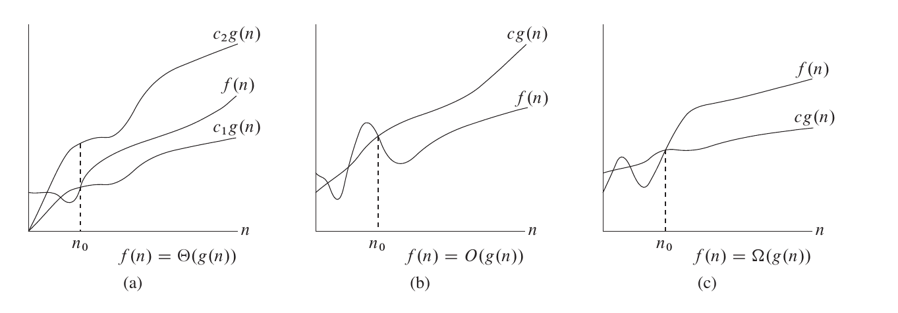

# 数据结构与算法

> 数据结构是程序的骨架，算法则是程序的灵魂。算法 + 数据结构 = 程序。

**算法**是解决问题的方法或者过程，**数据结构**是数据的计算机表示和相应的一组操作 --> **程序**是算法和数据结构的具体实现。


## 1 数据结构

> 数据结构（Data Structure）：带有结构特性的数据元素的集合。

数据结构，就是数据的组织结构，用来组织、存储数据。数据结构研究的是**数据的逻辑结构**、**物理结构**以及**它们之间的相互关系**，并对这种结构定义相应的运算，设计出相应的算法，并确保经过这些运算以后所得到的新结构仍保持原来的结构类型。数据结构的作用，就是为了**提高计算机硬件的利用率**。

对于数据结构，可以按照数据的**逻辑结构**和**物理结构**来进行分类。


### 1.1 数据的逻辑结构

逻辑结构（Logical Structure）：数据元素之间的相互关系。根据元素之间具有的不同关系，通常可以将数据的逻辑结构分为以下四种：

* 集合结构：数据元素同属于一个集合，除此之外无其他关系。

集合结构中的数据元素是**无序的**，并且每个数据元素都是**唯一的**，集合中没有相同的数据元素。


* 线性结构：数据元素之间是**一对一关系**。

线性结构中的数据元素（除了第一个和最后一个元素），左侧和右侧分别只有一个数据与其相邻。线性结构类型包括：**数组**、**链表**，以及由它们衍生出来的**栈、队列、哈希表**。


* 树形结构：数据元素之间是**一对多的层次关系**。

最简单的树形结构是**二叉树**。这种结构可以简单的表示为：**根， 左子树， 右子树**。 左子树和右子树又有自己的子树。当然除了二叉树，树形结构类型还包括：**多叉树、字典树**等。


* 图形结构：数据元素之间是**多对多的关系**。

图形结构是一种比树形结构更复杂的非线性结构，用于表示物件与物件之间的关系。一张图由一些小圆点（称为**顶点**或**结点**）和连结这些圆点的直线或曲线（称为**边**）组成。

在图形结构中，任意两个结点之间都可能相关，即结点之间的邻接关系可以是任意的。图形结构类型包括：**无向图**、**有向图**、**连通图**等。


### 1.2 数据的物理结构

物理结构（Physical Structure）：数据的逻辑结构在计算机中的存储方式。计算机内有多种存储结构，采用最多的是：**顺序存储结构**、**链式存储结构**。


*  顺序存储结构：将数据元素存放在一片地址连续的存储单元里，数据元素之间的逻辑关系通过数据元素的存储地址来直接反映。

在顺序存储结构中，逻辑上相邻的数据元素在物理地址上也必然相邻 。


优点：

    * 简单、易理解，且实际占用最少的存储空间

缺点：

    * 需要占用一片地址连续的存储单元
    * 存储分配要事先进行
    * 对于一些操作的时间效率较低（移动、删除元素等操作）


* 链式存储结构：将数据元素存放在任意的存储单元里，存储单元可以连续，也可以不连续。

链式存储结构中，逻辑上相邻的数据元素在物理地址上可能相邻，可也能不相邻。**其在物理地址上的表现是随机的**。链式存储结构中，一般将每个数据元素占用的若干单元的组合称为一个**链结点**。每个链结点不仅要存放一个**数据元素的数据信息**，还要存放一个指出**这个数据元素在逻辑关系的直接后继元素所在链结点的地址，该地址被称为指针**。换句话说，数据元素之间的逻辑关系是通过指针来间接反映的。

优点：

    * 存储空间不必事先分配，在需要存储空间的时候可以临时申请，不会造成空间的浪费
    * 一些操作的时间效率远比顺序存储结构高（插入、移动、删除元素）

缺点：
    
    * 不仅数据元素本身的数据信息要占用存储空间，指针也需要占用存储空间，链式存储结构比顺序存储结构的空间开销大


## 2 算法

> 算法（Algorithm）：解决特定问题求解步骤的准确而完整的描述，在计算机中表现为一系列指令的集合，算法代表着用系统的方法描述解决问题的策略机制。


算法是某一系列运算步骤，它表达解决某一类计算问题的一般方法，对这类方法的任何一个输入，它可以按步骤一步一步计算，最终产生一个输出。它不依赖于任何一种语言，可以用 自然语言、编程语言（Python、C、C++、Java 等）描述，也可以用 伪代码、流程图 来表示。


### 2.1 算法的基本特性

算法是一系列的运算步骤，这些运算步骤可以解决特定的问题。除此之外，算法应必须具备以下特性：

* 输入：对于待解决的问题，都要以某种方式交给对应的算法。在算法开始之前最初赋给算法的参数称为输入。

* 输出：算法是为了解决问题存在的，最终总需要返回一个结果。所以至少需要一个或多个参数作为算法的输出。

* 有穷性：**算法必须在有限的步骤内结束，并且应该在一个可接受的时间内完成**。

* 确定性：组成算法的每一条指令必须有着清晰明确的含义，不能令读者在理解时产生二义性或者多义性。就是说，算法的每一个步骤都必须准确定义而无歧义。

* 可行性：算法的每一步操作必须**具有可执行性**，在当前环境条件下可以通过**有限次运算**实现。也就是说，每一步都能通过执行有限次数完成，并且可以转换为程序在计算机上运行并得到正确的结果。


### 2.2 算法追求的目标

一个优秀的算法至少应该追求以下两个目标：

* 所需运行时间更少（时间复杂度更低）；
* 占用内存空间更小（空间复杂度更低）。


除了对运行时间和占用内存空间的追求外，一个好的算法还应该追求以下目标：

* 正确性：算法能够满足具体问题的需求，程序运行正常，无语法错误，能够通过典型的软件测试，达到预期的需求。

* 可读性：算法遵循标识符命名规则，简洁易懂，注释语句恰当，方便自己和他人阅读，便于后期修改和调试。

* 健壮性：算法对非法数据以及操作有较好的反应和处理。


## 3 算法复杂度

> 算法复杂度（Algorithm complexity）：在问题的输入规模为 n 的条件下，程序的时间使用情况和空间使用情况。


比较两个算法的优劣通常有两种方法：

* 事后统计：将两个算法各编写一个可执行程序，交给计算机执行，记录下各自的运行时间和占用存储空间的实际大小，从中挑选出最好的算法。

* 预先估算：在算法设计出来之后，根据算法中包含的步骤，估算出算法的运行时间和占用空间。比较两个算法的估算值，从中挑选出最好的算法。

由于第一种算法工作量较大，笔给你企鹅相同的算法，使用不同的语言实现，在不同的计算机上运行，所需要的运行时间都会有差距，因此一般采用预先估算的方法来衡量算法的好坏。

采用预先估算的方式下，编译语言、计算机运行速度都不是我们所考虑的对象。我们只关心随着问题规模 n 扩大的时候，时间开销、空间开销的增长情况。


### 3.1 时间复杂度

> 时间复杂度（Time Complexity）：在问题输入规模为 n 的情况下，算法运行所需要花费的时间，可以记作为 $T(n)$。

将**基本操作次数**作为时间复杂度的度量标准。时间复杂度跟算法中基本操作次数的数量正相关。基本操作 ：算法执行中的每一条语句。**每一次基本操作都可在常数时间内完成**。基本操作是一个运行时间不依赖于操作数的操作。

渐进符号（Asymptotic Symbol）：专门用来刻画函数的增长速度的。简单来说，渐进符号只保留了**最高阶幂**，忽略了一个函数中增长较慢的部分，比如低阶幂、系数、常量。因为当问题规模变的很大时，这几部分并不能左右增长趋势，所以可以忽略掉。

经常用到的渐进符号有三种： 

* 渐进紧确界符号 $\Theta$

> 对于函数 $f(n)$ 和 $g(n)$，$f(n) = \Theta(g(n))$。存在正常量 $c_1$、$c_2$ 和 $n_0$，使得对于所有 $n \ge n_0$ 时，有 $0 \le c_1 \cdot g(n) \le f(n) \le c_2 \cdot g(n)$。

如果函数 $f(n) = \Theta(g(n))$，那么我们能找到两个正数 $c_1$、$c_2$，使得 $f(n)$ 被 $c_1 \cdot g(n)$ 和 $c_2 \cdot g(n)$ 夹在中间。

例如：$T(n) = 3n^2 + 4n + 5 = \Theta(n^2)$，可以找到 $c_1 = 1$，$c_2 = 12$，$n_0 = 1$，使得对于所有 $n \ge 1$，都有 $n^2 \le 3n^2 + 4n + 5 \le 12n^2$。


* 渐进上界符号 $O$

> 对于函数 $f(n)$ 和 $g(n)$，$f(n) = O(g(n))$。存在常量 $c$，$n_0$，使得当 $n > n_0$ 时，有 $0 \le f(n) \le c \cdot g(n)$。

$\Theta$ 符号渐进地给出了一个函数的上界和下界，如果我们只知道一个函数的上界，可以使用 $O$ 渐进上界符号。


* 渐进下界符号 $\Omega$

> 对于函数 $f(n)$ 和 $g(n)$，$f(n) = \Omega(g(n))$。存在常量 $c$，$n_0$，使得当 $n > n_0$ 时，有 $0 \le c \cdot g(n) \le f(n)$。

如果我们只知道函数的下界，可以使用 $\Omega$ 渐进下界符号。




### 3.2 时间复杂度计算


渐进符号可以渐进地描述一个函数的上界、下界，同时也可以描述算法执行时间的增长趋势。在计算时间复杂度的时候，经常使用 $O$ 渐进上界符号。因为我们关注的通常是算法用时的上界，而不用关心其用时的下界。


求解时间复杂度一般分为以下几个步骤：

* **找出算法中的基本操作（基本语句）**：**算法中执行次数最多的语句就是基本语句**，通常是最内层循环的循环体部分。

* **计算基本语句执行次数的数量级**：只需要计算基本语句执行次数的数量级，即保证函数中的最高次幂正确即可。

* **用大 O 表示法表示时间复杂度**：将上一步中计算的数量级放入 O 渐进上界符号中。

同时，在求解时间复杂度还要注意一些原则：

* **加法原则**：总的时间复杂度等于量级最大的基本语句的时间复杂度。

> 如果 $T_1(n) = O(f_1(n))$，$T_2(n) = O(f_2(n))$，$T(n) = T_1(n) + T_2(n)$，则 $T(n) = O(f(n)) = max(O(f_1(n)), \enspace O(f_2(n))) = O(max(f_1(n), \enspace f_2(n)))$。

* **乘法原则**：循环嵌套代码的复杂度等于嵌套内外基本语句的时间复杂度乘积。

> 如果 $T_1 = O(f_1(n))$，$T_2 = O(f_2(n))$，$T(n) = T_1(n) \times T_2(n)$，则 $T(n) = O(f(n)) = O(f_1(n)) \times O(f_2(n)) = O(f_1(n) \times f_2(n))$。


#### 3.2.1 常数 $O(1)$

一般情况下，只要算法中不存在循环语句、递归语句，其时间复杂度都为 $O(1)$。

$O(1)$ 只是常数阶时间复杂度的一种表示方式，并不是指只执行了一行代码。只要代码的执行时间不随着问题规模 $n$ 的增大而增长，这样的算法时间复杂度都记为 $O(1)$。


#### 3.3.2 线性 $O(n)$

一般含有非嵌套循环，且单层循环下的语句执行次数为 $n$ 的算法涉及线性时间复杂度。这类算法随着问题规模 $n$ 的增大，对应计算次数呈线性增长。


#### 3.3.3 平方 $O(n^2)$

一般含有双层嵌套，且每层循环下的语句执行次数为 $n$ 的算法涉及平方时间复杂度。这类算法随着问题规模 $n$ 的增大，对应计算次数呈平方关系增长。


#### 3.3.4 阶乘 $O(n!)$

阶乘时间复杂度一般出现在**全排列**、**旅行商问题暴力解法**相关的算法中。这类算法随着问题规模 $n$ 的增大，对应计算次数呈阶乘关系增长。

```python
def permutations(arr, start, end):
    if start == end:
        print(arr)
        return
 
    for i in range(start, end):
        arr[i], arr[start] = arr[start], arr[i]
        permutations(arr, start + 1, end)
        arr[i], arr[start] = arr[start], arr[i]
```

上述代码中实现**全排列**使用了递归的方法。假设数组 $arr$ 长度为 $n$，第一层 `for` 循环执行了 $n$ 次，第二层` for` 循环执行了 $n - 1$ 次。以此类推，最后一层` for` 循环执行了 $1$ 次，将所有层` for` 循环的执行次数累乘起来为 $n \times (n - 1) \times (n - 2) \times … \times 2 \times 1 = n!$ 次。则整个算法的 `for` 循环中基本语句的执行次数为 $n!$ 次，所以对应时间复杂度为 $O(n!)$。


#### 3.3.5 对数 $O(\log n)$

对数时间复杂度一般出现在**二分查找**、**分治**这种一分为二的算法中。这类算法随着问题规模 $n$ 的增大，对应的计算次数呈对数关系增长。

因为 $\log_2 n = k \times \log_{10} n$，这里 $k \approx 3.322$，是一个常数系数，$\log_2 n$ 与 $\log_{10} n$ 之间差别比较小，可以忽略 $k$。并且 $\log_{10} n$ 也可以简写成 $\log n$，所以为了方便书写，通常我们将对数时间复杂度写作是 $O(\log n)$。


#### 3.3.6 线性对数 $O(n \times \log n)$

线性对数一般出现在排序算法中，例如**快速排序**、**归并排序**、**堆排序**等。这类算法随着问题规模 $n$ 的增大，对应的计算次数呈线性对数关系增长。


#### 3.3.7 常见时间复杂度关系

根据从小到大排序，常见的时间复杂度主要有：

$O(1)$ < $O(\log n)$ < $O(n)$ < $O(n \times \log n)$ < $O(n^2)$ < $O(n^3)$ < $O(2^n)$ < $O(n!)$ < $O(n^n)$。


### 3.4 最佳、最坏、平均时间复杂度

时间复杂度是一个关于输入问题规模 $n$ 的函数。但是因为输入问题的内容不同，习惯将**时间复杂度**分为**最佳**、**最坏**、**平均**三种情况。这三种情况的具体含义如下：

* **最佳时间复杂度**：每个输入规模下用时最短的输入所对应的时间复杂度。
* **最坏时间复杂度**：每个输入规模下用时最长的输入所对应的时间复杂度。
* **平均时间复杂度**：每个输入规模下所有可能的输入所对应的平均用时复杂度（随机输入下期望用时的复杂度）。


最佳时间复杂度和最坏时间复杂度都是极端条件下的时间复杂度，发生的概率其实很小。为了能更好的表示正常情况下的复杂度，所以我们一般采用平均时间复杂度作为时间复杂度的计算方式。


### 3.5 空间复杂度


> 空间复杂度（Space Complexity）：在问题的输入规模为 $n$ 的条件下，算法所占用的空间大小，可以记作为 $S(n)$。一般将 **算法的辅助空间** 作为衡量空间复杂度的标准。


前面的渐进符号，也同样适用于空间复杂度的度量。空间复杂度的函数可以表示为 $S(n) = O(f(n))$，它表示的是随着问题规模 $n$ 的增大，算法所占空间的增长趋势跟 $f(n)$ 相同。


相比于算法的时间复杂度计算来说，算法的空间复杂度更容易计算，主要包括**局部变量（算法范围内定义的变量）所占用的存储空间**和**系统为实现递归（如果算法是递归的话）所使用的堆栈空间**两个部分。


### 3.6 空间复杂度计算


#### 3.6.1 常数 $O(1)$


算法代码中的局部变量，其所占空间大小为常数阶，并不会随着问题规模 $n$ 的在增大而增大，所以该算法的空间复杂度为 $O(1)$。


#### 3.6.2 线性 $O(n)$


算法中的额外变量随着问题规模 $n$ 的在增大而线性增大的空间复杂度为 $O(n)$。


#### 3.6.3 常见空间复杂度关系

根据从小到大排序，常见的算法复杂度主要有：

$O(1)$ < $O(\log n)$ < $O(n)$ < $O(n^2)$ < $O(2^n)$


## 4 LeetCode Tips

* 五分钟思考法

如果一道题如果 5 分钟之内有思路，就立即动手写代码解题。如果 5 分钟之后还没有思路，就直接去看题解。然后根据题解的思路，自己去实现代码。如果发现自己看了题解也无法实现代码，就认真阅读题解的代码，并理解代码的逻辑。


* 重复刷题

遇见不会的题，多刷几遍，不断加深理解。

算法题有时候一遍刷过去，过的时间长了可能就忘了，看到之前做的题不能够立马想到解题思路。题目刷完一遍并不是结束了，还需要不断的回顾。而且，一道题目可能有多种解法，还可能有好的算法思路。最开始做的时候，可能只能想到一种思路，再做第二遍的时候，很有可能会想到了新的解法，新的优化方式等等。


* 按专题分类刷题

按照不同专题分类刷题，既可以巩固刚学完的算法知识，还可以提高刷题效率。


* 写解题报告

如果能够用简介清晰的语言让别人听懂这道题目的思路，那就说明你真正理解了这道题的解法，即费曼学习法。这也是这个项目的来源了。

另外，如果在写题的时候遇到之前刷过的题，但一时之间没有思路的，就可以看看自己之前的解题报告。这样就节省了大量重复刷题的时间。


* 坚持刷题

算法刷题没有捷径，只有不断的刷题、总结，再刷题，再总结。

学习算法和数据结构知识，不能靠速成，只能靠不断的积累，一步一步的推敲算法步骤，一遍又一遍的理解算法思想，才能掌握一个又一个的算法知识。而且还要不断的去刷该算法对应专题下的题目，才能将算法知识应用到日常的解题过程中。这样才能算彻底掌握了一个算法或一种解题思路。


## 5 practice

基础题，没啥说的:

* [2235_两数相加]()
* [1929_数组串联]()
* [0771_宝石与石头]()
* [1480_一维数组的动态和]()
* [0709_转换成小写字母]()
    最想到的是两种方法：

    1）使用 `tolower()` 函数

    ```cpp
    for (int i = 0; i < s.size(); i++) {
        s[i] = tolower(s[i]);
    }
    return s;
    ```

    2）使用 ASCII 计算，在 ASCII 中，大小字母比小写字母小 32：

    ```cpp
    for (int i = 0; i < s.size(); i++) {
        if (s[i] >= 'A' && s[i] <= 'Z') {
            s[i] += 32;
        }
    }
    return s;
    ```
    
* [1672_最富有客户的资产总量]()
