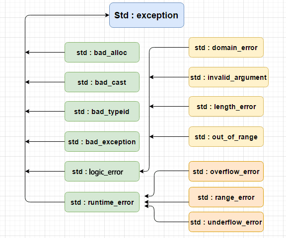

# C++ 的高级操作

## 1 文件和流

前面经常使用 iostream 标准库，它提供了 cin 和 cout 方法分别用于从标准输入读取流和向标准输出写入流。

这里学习如何从文件读取流和向文件写入流。这需要用到 C++ 中另一个标准库 fstream，它定义了三个新的数据类型：

* `ofstream`：该数据类型表示输出文件流，用于创建文件并向文件写入信息。
* `ifstream`：该数据类型表示输入文件流，用于从文件读取信息。
* `fstream`：该数据类型通常表示文件流，且同时具有 ofstream 和 ifstream 两种功能，可以创建文件，向文件写入信息，从文件读取信息。

要在 C++ 中进行文件处理，必须在 C++ 源代码文件中包含头文件 `<iostream>` 和 `<fstream>`


### 1.1 打开文件

在从文件读取信息或者向文件写入信息之前，必须先打开文件。`ofstream` 和 `fstream` 对象都可以用来打开文件进行写操作，如果只需要打开文件进行读操作，则使用 `ifstream` 对象。

open() 函数是 fstream、ifstream 和 ofstream 对象的一个成员:

```cpp
void open(const char* filename, ios::openmode mode);
```

open() 成员函数的第一参数指定要打开的文件的名称和位置，第二个参数定义文件被打开的模式:

* `ios::app`：追加模式。所有写入都追加到文件末尾
* `ios::ate`：文件打开后定位到文件末尾
* `ios::in`：打开文件用于读取
* `ios::out`: 打开文件用于写入
* `ios::trunc`: 如果该文件已经存在，其内容将在打开文件之前被截断，即把文件长度设为 0。


可以把以上两种或两种以上的模式结合使用。

例如，如果想要以写入模式打开文件，并希望截断文件，以防文件已存在，那么可以使用下面的语法：

```cpp
ofstream outfile;
outfile.open("file.dat", ios::out | ios::trunc );
```

类似地，如果想要打开一个文件用于读写，可以使用下面的语法：

```cpp
ifstream  afile;
afile.open("file.dat", ios::out | ios::in );
```


### 1.2 关闭文件

当 C++ 程序终止时，它会自动关闭刷新所有流，释放所有分配的内存，并关闭所有打开的文件。但程序员应该养成一个好习惯，在程序终止前关闭所有打开的文件。

close() 函数是 fstream、ifstream 和 ofstream 对象的一个成员：

```cpp
void close();
```


### 1.3 写入文件

在 C++ 编程中，使用流插入运算符（ `<<` ）向文件写入信息，就像使用该运算符输出信息到屏幕上一样。唯一不同的是，在这里使用的是 `ofstream` 或 `fstream` 对象，而不是 `cout` 对象。


### 1.4 读取文件

在 C++ 编程中，使用流提取运算符（ `>>` ）从文件读取信息，就像使用该运算符从键盘输入信息一样。唯一不同的是，在这里使用的是 `ifstream` 或 `fstream` 对象，而不是 `cin` 对象。

以读写模式打开一个文件，在向文件 `afile.dat` 写入用户输入的信息之后，程序从文件读取信息，并将其输出到屏幕上：

```cpp
#include <iostream>
#include <fstream>
using namespace std;

int main() {
    char data[100];

    // 以写模式打开文件
    ofstream outfile;
    outfile.open("afile.dat");

    cout << "Writing to the file" << endl;
    cout << "Enter your name: ";
    cin.getline(data, 100);

    // 向文件写入文件
    outfile << data << endl;

    cout << "Enter your age: ";
    cin >> data;
    cin.ignore();

    // 再次向文件写入用户输入的数据
    outfile << data << endl;

    // 关闭打开的文件
    outfile.close();

    // 以读模式打开文件
    ifstream infile;
    infile.open("afile.dat");

    cout << "Reading from the file: " << endl;
    infile >> data;

    // 在屏幕上写入数据
    cout << data << endl;

    // 再次从文件读取数据，并显示它
    infile >> data;
    cout << data << endl;

    // 关闭打开的文件
    infile.close();
    return 0;
}
```

说明：

* `cin.getline()`函数从外部读取一行
* `cin.ignore()` 函数会忽略掉之前读语句留下的多余字符


### 1.5 文件位置指针

`istream` 和 `ostream` 都提供了用于重新定位文件位置指针的成员函数。这些成员函数包括关于 `istream` 的 `seekg（"seek get"`）和关于 `ostream` 的 `seekp（"seek put"）`。

`seekg` 和 `seekp` 的参数通常是一个**长整型**。第二个参数可以用于指定查找方向。查找方向可以是 `ios::beg`（默认的，**从流的开头开始定位**），也可以是 `ios::cur`（**从流的当前位置开始定位**），也可以是 `ios::end`（**从流的末尾开始定位**）。

**文件位置指针是一个整数值，指定了从文件的起始位置到指针所在位置的*字节数***,

```cpp
// 定位到 fileObj 的第 n 个字节（ios::begin）
fileObj.seekg(n);

// 把文件的读指针从 fileObj 当前位置向后移 n 个字节
fileObj.seekg(n, ios::cur);

// 把文件的读指针从 fileObject 末尾往回移 n 个字节
fileObj.seekg(n, ios::end);

// 定位到 fileObject 的末尾
fileObj.seekg(0, ios::end);
```


## 2 异常处理

异常是程序在执行期间产生的问题。C++ 异常是指在程序运行时发生的特殊情况，比如尝试除以零的操作。

异常提供了一种转移程序控制权的方式。C++ 异常处理涉及到三个关键字：`try`、`catch`、`throw`。

* `throw`: 当问题出现时，程序会抛出一个异常。这是通过使用 `throw` 关键字来完成的。
* catch: 在想要处理问题的地方，通过异常处理程序捕获异常。`catch` 关键字用于捕获异常。
* `try`: `try` 块中的代码标识将被激活的特定异常。它后面通常跟着一个或多个 `catch` 块。

如果有一个块抛出一个异常，捕获异常的方法会使用 `try` 和 `catch` 关键字。**`try` 块中放置可能抛出异常的代码**，`try` 块中的代码被称为保护代码。使用 `try/catch` 语句的语法如下所示：

```cpp
try {
    // 保护代码，即可能发生错误的代码
} catch (ExceptionName e1) {
    // catch 块
} catch (ExcertionName e2) {
    // catch 块
} catch (ExceptionName eN) {
    // catch 块
}
```

如果 try 块在不同的情境下会抛出不同的异常，这个时候可以尝试罗列多个 catch 语句，用于捕获不同类型的异常。


### 2.1 抛出异常

可以使用 throw 语句在代码块中的任何地方抛出异常。throw 语句的操作数可以是任意的表达式，**表达式的结果的类型决定了抛出的异常的类型**。

以下是尝试除以零时抛出异常的实例：

```cpp
double division(int a, int b) {
    if (b == 0) {
        throw "Division by zero condition!";
    }
    return (a/b);
}
```


### 2.2 捕获异常

catch 块跟在 try 块后面，用于捕获异常。可以指定想要捕捉的异常类型，这是由 catch 关键字后的括号内的异常声明决定的。

```cpp
try {
    // 保护代码
} catch (ExceptionName e) {
  // 处理 ExceptionName 异常的代码
}
```

上面的代码会捕获一个类型为 ExceptionName 的异常。如果想让 catch 块能够处理 try 块抛出的任何类型的异常，则**必须在异常声明的括号内使用省略号 `...`**，如下所示：

```cpp
try {
   // 保护代码
} catch(...) {
  // 能处理任何异常的代码
}
```

抛出一个除以零的异常，并在 catch 块中捕获该异常:

```cpp
#include <iostream>

double division(int a, int b) {
    if (b == 0) {
        throw "Division by zero condition!";
    }
    return (a/b);
}

int main() {
    int x = 50;
    int y = 0;
    double z = 0;
    try {
        z = division(x, y);
        std::cout << z << std::endl;
    } catch (const char* msg) {
        std::cerr << msg << std::endl;
    }
    return 0;
}
```

由于在函数 `division` 抛出了一个类型为 `const char*` 的异常，因此，当捕获该异常时，必须在 `catch` 块中使用 `const char*`。

输出：

```bash
Division by zero condition!
```


### 2.3 C++ 标准的异常

C++ 提供了一系列标准的异常，定义在 `<exception>` 中，可以在程序中使用这些标准的异常。它们是以父子类层次结构组织起来的，如下所示：




* `std::exception`: 该异常是所有标准 C++ 异常的父类
* `std::bad_alloc`: 该异常可以通过 `new` 抛出
* `std::bad_cast`: 该异常可以通过 `dynamic_cast` 抛出
* `std::bad_typeid`: 该异常可以通过 `typeid` 抛出
* `std::bad_exception`: 这在处理 C++ 程序中无法预期的异常时非常有用
* `std::logic_error`: 理论上可以通过读取代码来检测到的异常
* `std::domain_error`: 当使用了一个**无效的数学域**时，会抛出该异常
* `std::invalid_argument`: 当使用了**无效的参数**时，会抛出该异常
* `std::length_error`: **当创建了太长的 `std::string` 时**，会抛出该异常
* `std::out_of_range`: 该异常可以通过方法抛出，例如 `std::vector` 和 `std::bitset<>::operator[]()`
* `std::runtime_error`: 理论上不可以通过读取代码来检测到的异常
* `std::overflow_error`: 当发生**数学上溢**时，会抛出该异常
* `std::range_error`: 当**尝试存储超出范围的值时**，会抛出该异常。
* `std::underflow_error`: 当发生**数学下溢**时，会抛出该异常


### 2.4 自定义异常

可以通过继承和重载 `exception` 类来定义新的异常。使用 `std::exception` 类来实现自己的异常：

```cpp
#include <iostream>
#include <exception>

struct CustomException: public std::exception {
    const char* what() const throw() {
        return "C++ Exception";
    }
};


int main() {
    try {
        throw CustomException();
    } catch (CustomException& e) {
        std::cout << "Custon Excextion caught" << std::endl;
        std::cout << e.what() << std::endl;
    } catch (std::exception& e) {
        std::cout << "Other Error" << std::endl;
    }
    return 0;
}
```

输出：

```cpp
Custon Excextion caught
C++ Exception
```

说明：

* `what()` 是异常类提供的一个公共方法，它被所有子异常类重载, 返回异常产生的原因。


## 3 动态内存

C++ 程序中的内存分为两个部分：

* 栈：在函数内部声明的所有变量都将占用栈内存。
* 堆：这是程序中未使用的内存，在程序运行时可用于动态分配内存。

很多时候，无法提前预知需要多少内存来存储某个定义变量中的特定信息，所需内存的大小需要在运行时才能确定。在 C++ 中，可以使用 `new` 运算符为给定类型的变量在运行时分配堆内的内存，并返回所分配的空间地址。

在不再需要动态分配的内存空间时，可以使用 `delete` 运算符，删除之前由 `new` 运算符分配的内存。


### 3.1 new 和 delete 运算符

使用 new 运算符来为任意的数据类型动态分配内存的通用语法：

```cpp
new data-type;
```

data-type 可以是包括数组在内的任意内置的数据类型，也可以是包括类或结构在内的用户自定义的任何数据类型。

```cpp
double* pvalue = NULL;  // 初始化为 null 的指针
pvalue = new double;    // 为变量请求内存
```

如果自由存储区已被用完，可能无法成功分配内存。建议检查 new 运算符是否返回 NULL 指针，并采取以下适当的操作：

```cpp
double* pvalue = NULL;
if (!pvalue = new double) {
    std::cout << "Error: out of memory." << std::endl;
    exit(1);
}
```

`malloc()` 函数在 C 语言中就出现了，在 C++ 中仍然存在，但建议尽量不要使用 `malloc()` 函数。new 与 malloc() 函数相比，其主要的优点是，**new 不只是分配了内存，它还创建了对象**。

在任何时候，当某个已经动态分配内存的变量不再需要使用时，可以使用 `delete` 操作符释放它所占用的内存，如下所示：

```cpp
delete pvalue;  // 释放 pvalue 所指向的内存
```


### 3.2 数组的动态内存分配

假设要为一个字符数组（一个有 20 个字符的字符串）分配内存，可以使用上面的语法来为数组动态地分配内存，如下所示：

```cpp
char* pvalue = NULL;    // 初始化为 null 的指针
pvalue = new char[20];  // 为变量请求内存
```

删除刚才创建的数组，

```cpp
delete[] pvalue;   // 删除 pvalue 所指向的数组
```

new 操作符的通用语法，可以为多维数组分配内存:

```cpp
// 一维数组
// 动态分配,数组长度为 m
int *array = new int[m];

// 释放内存
delete[] array;


// 二维数组
int** array;
// 假定数组第一维长度为 m， 第二维长度为 n
// 动态分配空间
array = new int* [m];
for (int i = 0; i < m; i++) {
    array[i] = new int[n];
}

// 释放
for (int i = 0; i < m; i++) {
    delete[] array[i];
}
delete[] array;


// 三维数组
int*** array;
// 假定数组第一维为 m， 第二维为 n， 第三维为h
// 动态分配空间
array = new int** [m];
for (int i = 0; i < m; i++) {
    array[i] = new int* [n];
    for (int j = 0; j < n; j++) {
        array[i][j] = new int [h];
    }
}

// 释放
for (int i = 0; i < m; i++) {
    for (int j = 0; j < n; j++) {
        delete[] array[i][j];
    }
    delete[] array[i];
}
delete[] array;
```


### 3.3 对象的动态内存分配

对象与简单的数据类型类似：

```cpp
#include <iostream>

class Box {
    public:
        Box() {
            std::cout << "调用构造函数！" << std::endl;
        }
        ~Box() {
            std::cout << "调用析构函数！" << std::endl;
        }
};

int main() {
    Box* box = new Box[4];
    delete[] box;   // 删除数组
    return 0;
}
```

为一个包含四个 Box 对象的数组分配内存，构造函数将被调用 4 次，同样地，当删除这些对象时，析构函数也将被调用相同的次数（4次）。

输出：

```cpp
调用构造函数！
调用构造函数！
调用构造函数！
调用构造函数！
调用析构函数！
调用析构函数！
调用析构函数！
调用析构函数！
```


## 4 命名空间

命名空间可作为附加信息来区分不同库中相同名称的函数、类、变量等。使用了命名空间即定义了上下文。本质上，命名空间就是定义了一个范围。


### 4.1 定义命名空间

命名空间的定义使用关键字 namespace，后跟命名空间的名称，

```cpp
namespace namespace_name {
    // 代码
}
```

为了调用带有命名空间的函数或变量，需要在前面加上命名空间的名称，

```cpp
name::code; // code 可以是变量或函数
```

```cpp
#include <iostream>

// 第一个命名空间
namespace firt_space {
    int a = 0;
    void func() {
        std::cout << "Inside first_space" << std::endl;
    }
}

// 第二个命名空间
namespace second_space {
    double a = 1.1;
    void func() {
        std::cout << "Inside second_space" << std::endl;
    }
}

int main() {
    auto a = firt_space::a;
    std::cout << "a = " << a << std::endl;
    firt_space::func();

    second_space::a += 2.2;
    std::cout << "second_space::a: " << second_space::a << std::endl;
    second_space::func();

    return 0;
}
```


### 4.2 using 指令

可以使用 using namespace 指令，这样在使用命名空间时就可以不用在前面加上命名空间的名称。这个指令会告诉编译器，后续的代码将使用指定的命名空间中的名称。

```cpp
#include <iostream>

// 第一个命名空间
namespace firt_space {
    int a = 0;
    void func() {
        std::cout << "Inside first_space" << std::endl;
    }
}

// 第二个命名空间
namespace second_space {
    double a = 1.1;
    void func() {
        std::cout << "Inside second_space" << std::endl;
    }
}


using namespace std;
using namespace firt_space;
int main() {
    cout << "a = " << a << endl;
    func();

    return 0;
}
```

using 指令也可以用来指定命名空间中的特定项目。例如，如果只使用 std 命名空间中的 cout 部分，可以使用如下的语句：

```cpp
using std::cout;
```

随后的代码中，在使用 cout 时就可以不用加上命名空间名称作为前缀，但是 std 命名空间中的其他项目仍然需要加上命名空间名称作为前缀，

```cpp
#include <iostream>
using std::cout;

int main() {
    int a = 0;
    cout << "a = " << a << std::endl;

    return 0;
}
```

using 指令引入的名称遵循正常的范围规则。名称从使用 using 指令开始是可见的，直到该范围结束。此时，在范围以外定义的同名实体是隐藏的。


### 4.3 不连续的命名空间

命名空间可以定义在几个不同的部分中，一个命名空间的各个组成部分可以分散在多个文件中。所以，如果命名空间中的某个组成部分需要请求定义在另一个文件中的名称，则仍然需要声明该名称。下面的命名空间定义可以是定义一个新的命名空间，也可以是为已有的命名空间增加新的元素：

```cpp
namespace namespace_name {
   // 代码声明
}
```


### 4.4 嵌套的命名空间

命名空间可以嵌套，可以在一个命名空间中定义另一个命名空间，如下所示：

```cpp
namespace namespace_name1 {
   // 代码声明
   namespace namespace_name2 {
      // 代码声明
   }
}
```

可以通过使用 :: 运算符来访问嵌套的命名空间中的成员：

```cpp
using namespace namespace_name1::namespace_name2;
using namespace namespace_name1;
```

```cpp
#include <iostream>

// 第一个命名空间
namespace firt_space {
    int a = 0;
    void func() {
        std::cout << "Inside first_space" << std::endl;
    }
    // 第二个命名空间
    namespace second_space {
        double a = 1.1;
        void func() {
            std::cout << "Inside second_space" << std::endl;
        }
    }
}

using namespace firt_space::second_space;
int main() {

    // 调用第二个命名空间中的函数
    func();
    return 0;
}
```


## 5 模板

模板是泛型编程的基础，泛型编程以一种独立于任何特定类型的方式编写代码。

模板是创建泛型类或函数的蓝图或公式。库容器，比如迭代器和算法，都是泛型编程的例子，它们都使用了模板的概念。每个容器都有一个单一的定义，比如 向量，我们可以定义许多不同类型的向量，比如 `vector <int>` 或 `vector <string>`。


### 5.1 函数模板

模板函数定义的一般形式如下所示：

```cpp
template <typename type> ret-type func-name(parameter list) {
    // 函数主体
}
```

`type` 是函数所使用的数据类型的占位符名称。这个名称可以在函数定义中使用。

```cpp
#include <iostream>
#include <string>

template <typename T> inline T const& Max (T const& a, T const& b) {
    return a > b ? a : b;
}

int main() {
    int a = 22, b = 12;
    std::cout << "Max(a, b): " << Max(a, b) << std::endl;

    double c = 1.2;
    double d = 3.5;
    std::cout << "Max(c, d): " << Max(c, d) << std::endl;

    std::string e = "Hello";
    std::string f = "World";
    std::cout << "Max(e, f): " << Max(e, f) << std::endl;

    return 0;
}
```


### 5.2 类模板

泛型类声明的一般形式如下所示：

```cpp
template <class type> class class-name {
    ...
}
```

type 是占位符类型名称，可以在类被实例化的时候进行指定。可以使用一个逗号分隔的列表来定义多个泛型数据类型。

```cpp
#include <iostream>
#include <string>
#include <vector>
#include <cstdlib>
#include <stdexcept>

template <class T>
class Stack {
    private:
        std::vector<T> elems;
    public:
        void push(T const&);
        void pop();
        T top();
        bool empty() const {
            return elems.empty();
        }
};

template <class T>
void Stack<T>::push(T const& elem) {
    this->elems.push_back(elem);
}

template <class T> void Stack<T>::pop() {
    if (this->elems.empty()) {
        throw std::out_of_range("Stack<>::pop(): empty stack");
    }
    elems.pop_back();
}

template <class T>
T Stack<T>::top() {
    if (this->elems.empty()) {
        throw std::out_of_range("Stack<>::top(): empty stack");
    }
    return elems.back();
}


int main() {
    try {
        Stack<int> intStack;
        Stack<std::string> stringStack;

        intStack.push(7);
        std::cout << intStack.top() << std::endl;

        stringStack.push("hello");
        std::cout << stringStack.top() << std::endl;
        stringStack.pop();
        stringStack.pop();
    } catch (std::exception const& e) {
        std::cerr << "Exception: " << e.what() << std::endl;
        return -1;
    }
    return 0;
}
```


## 6 预处理器

预处理器是一些指令，指示编译器在实际编译之前所需完成的预处理。所有的预处理器指令都是以井号（`#`）开头，**只有空格字符可以出现在预处理指令之前**。**预处理指令不是 C++ 语句，所以它们不会以分号（;）结尾**。

`#include` 指令, 这个宏用于把头文件包含到源文件中。C++ 还支持很多预处理指令，比如 `#include`、`#define`、`#if`、`#else`、`#line` 等。


### 6.1 #define 预处理

`#define` 预处理指令用于**创建符号常量**。该符号常量通常称为宏，指令的一般形式是：

```cpp
#define macro-name replacement-text
```

当这一行代码出现在一个文件中时，在该文件中后续出现的所有宏都将会在程序编译之前被替换为 replacement-text。例如：

```cpp
#include <iostream>

#define PI 3.14159

int main() {
    std::cout << "Value of Pi: " << PI << std::endl;
    return 0;
}
```

测试这段代码，看看预处理的结果。使用 `-E` 选项进行编译，并把结果重定向到 `test.p`。

```bash
g++ -E test.cpp > test.p
```

`test.p` 文件已经包含大量的信息，而且在文件底部的值被改为如下：

```cpp
...
int main() {
    std::cout << "Value of Pi: " << 3.14159 << std::endl;
    return 0;
}
```


### 6.2 参数宏

可以使用 #define 来定义一个带有参数的宏，如下所示：

```cpp
#include <iostream>

#define MIN(a, b) (a < b ? a : b)

int main() {
    int i, j;
    i = 100;
    j = 10;
    std::cout << "MIN(i, j): " << MIN(i, j) << std::endl;
    return 0;
}
```


### 6.3 条件编译

可以有选择地对部分程序源代码进行编译。这个过程被称为条件编译。条件预处理器的结构与 if 选择结构很像。

```cpp
#ifdef NUMM
    #define NULL 0
#endif
```

可以只在调试时进行编译，调试开关可以使用一个宏来实现，如下所示：

```cpp
#ifdef DEBUG
    std::cerr << "Variable x = " << x << std::endl;
#endif
```

```cpp
#include <iostream>
using namespace std;

// #define DEBUG
#define MIN(a,b) (((a)<(b)) ? a : b)

int main() {
    int i, j;
    i = 100;
    j = 10;
    #ifdef DEBUG
        std::cerr << "Trace: Inside main function" << std::endl;
    #endif

    #if 0
        /* 这是注释部分 */
        cout << MKSTR(HELLO C++) << endl;
    #endif

    cout <<"The minimum is " << MIN(i, j) << endl;

    #ifdef DEBUG
        cerr <<"Trace: Coming out of main function" << endl;
    #endif
    return 0;
}
```

上面的代码输出：

```cpp
The minimum is 10
```

把 `// #define DEBUG`取消注释，输出：

```cpp
Trace: Inside main function
The minimum is 10
Trace: Coming out of main function
```


### 6.4 `#` 和 `##` 运算符

`#` 和 `##` 预处理运算符在 C++ 和 ANSI/ISO C 中都是可用的。


`#` 运算符会把 replacement-text 令牌转换为用引号引起来的字符串。

```cpp
#include <iostream>

#define MKSTR(x)    #x

int main() {
    std::cout << MKSTR(HELLO C++) << std::endl;
    return 0;
}
```

输出：

```cpp
HELLO C++
```

实际上，在编译之前，C++ 预处理器把 `std::cout << MKSTR(HELLO C++) << std::endl;` 替换成了 `std::cout << "HELLO C++" << std::endl;`


`##` 运算符用于连接两个令牌。

```cpp
#define CONCAT(x, y) x ## y
```

当 `CONCAT` 出现在程序中时，它的参数会被连接起来，并用来取代宏。例如，程序中 `CONCAT(HELLO, C++)` 会被替换为 `"HELLO C++"`，如下面实例所示。

```cpp
#include <iostream>
using namespace std;
 
#define concat(a, b) a ## b
int main() {
   int xy = 100;
   
   cout << concat(x, y);
   return 0;
}
```

输出：

```bash
100
```

在编译之前，C++ 预处理器把 `cout << concat(x, y);` 替换成了 `cout << xy;`


### 6.5 C++ 中的预定义宏

* `__LINE__`: 这会在程序编译时包含当前行号。
* `__FILE__`: 这会在程序编译时包含当前文件名。
* `__DATE__`: 这会包含一个形式为 `month/day/year` 的字符串，它表示把源文件转换为目标代码的日期。
* `__TIME__`: 这会包含一个形式为 `hour:minute:second` 的字符串，它表示程序被编译的时间。

```cpp
#include <iostream>

int main() {
    std::cout << "Value of __FILE__: " << __FILE__ << std::endl;
    std::cout << "Value of __LINE__: " << __LINE__ << std::endl;
    std::cout << "Value of __DATE__: " << __DATE__ << std::endl;
    std::cout << "Value of __TIME__: " << __TIME__ << std::endl;
    return 0;
}
```

