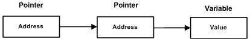

# C++ 基本语法结构


## 1 C++ 循环

一般情况下，语句是顺序执行的：函数中的第一个语句先执行，接着是第二个语句，依此类推。循环语句允许我们多次执行一个语句或语句组。


### 1.1 循环类型

C++ 编程语言提供了以下几种循环类型：

|循环类型|描述|
|---|---|
|while 循环|当给定条件为真时，重复语句或语句组。它会在执行循环主体之前测试条件。|
|for 循环|多次执行一个语句序列，简化管理循环变量的代码。|
|do...while 循环|除了它是在循环主体结尾测试条件外，其他与 while 语句类似|
|嵌套循环|可以在 while、for 或 do..while 循环内使用一个或多个循环|


#### 1.1.1 while 循环

C++ 中 while 循环的语法：

```cpp
while (condition) {
    statements;
}
```

在这里，statement(s) 可以是一个单独的语句，也可以是几个语句组成的代码块。condition 可以是任意的表达式，当为任意非零值时都为真。当条件为真时执行循环。

当条件为假时，程序流将继续执行紧接着循环的下一条语句。

while 循环的关键点是**循环可能一次都不会执行**。当条件被测试且结果为假时，会跳过循环主体，直接执行紧接着 while 循环的下一条语句。


#### 1.1.2 for 循环

C++ 中 for 循环的语法：

```cpp
for (init; condition; increment) {
    statements;
}
```

for 循环的控制流：

* init 会首先被执行，且只会执行一次。这一步允许声明并初始化任何循环控制变量。也可以不在这里写任何语句，只要有一个分号出现即可。
* 接下来，会判断 condition。如果为真，则执行循环主体。如果为假，则不执行循环主体，且控制流会跳转到紧接着 for 循环的下一条语句。
* 在执行完 for 循环主体后，控制流会跳回上面的 increment 语句。该语句允许更新循环控制变量。该语句可以留空，只要在条件后有一个分号出现即可。
* 条件再次被判断。如果为真，则执行循环，这个过程会不断重复（循环主体，然后增加步值，再然后重新判断条件）。在条件变为假时，for 循环终止。


**基于范围的for循环(C++11)**

for 语句允许简单的范围迭代：

```cpp
int arr[5] = {1, 2, 3, 4, 5};
for (int &x: arr) {
    x *= 2;
    cout << x << endl;
}

// auto 类型也是 C++11 新标准中的，用来自动获取变量的类型
for (auto& x: arr) {
    x *= 2;
    cout << x << endl;
}

string str("some string");  
// range for 语句
for (auto& c: str) {
    c = toupper(c);
}
```


#### 1.1.3 do...while 循环

do...while 循环在循环的尾部检查它的条件，do...while 循环会确保至少执行一次循环。

C++ 中 do...while 循环的语法：

```cpp
do {
    statements;
} while (condition);
```


#### 1.1.4 嵌套循环

一个循环内可以嵌套另一个循环。**C++ 允许至少 256 个嵌套层次**。

C++ 中 嵌套 for 循环 语句的语法：

```cpp
for ( init; condition; increment ) {
   for ( init; condition; increment ) {
      statement(s);
   }
   statement(s); // 可以放置更多的语句
}
```

C++ 中 嵌套 while 循环 语句的语法：

```cpp
while(condition) {
   while(condition) {
      statement(s);
   }
   statement(s); // 可以放置更多的语句
}
```

C++ 中 嵌套 do...while 循环 语句的语法：

```cpp
do {
   statement(s); // 可以放置更多的语句
   do {
      statement(s);
   } while ( condition );
 
} while ( condition );
```

可以在任何类型的循环内嵌套其他任何类型的循环。


### 1.2 循环控制语句


循环控制语句更改执行的正常序列。当执行离开一个范围时，所有在该范围中创建的自动对象都会被销毁。

C++ 提供了下列的控制语句。

|控制语句|描述|
|---|---|
|break 语句|终止 loop 或 switch 语句，程序流将继续执行紧接着 loop 或 switch 的下一条语句。|
|continue 语句|引起循环跳过主体的剩余部分，立即重新开始测试条件。|
|goto 语句|将控制转移到被标记的语句。但是不建议在程序中使用 goto 语句。|


#### 1.2.1 break 语句

C++ 中 break 语句有以下两种用法：

* 当 break 语句出现在一个循环内时，循环会立即终止，且程序流将继续执行紧接着循环的下一条语句。
* 用于终止 switch 语句中的一个 case。

如果使用的是嵌套循环，break 语句会停止执行最内层的循环，然后开始执行该块之后的下一行代码。

C++ 中 break 语句的语法：

```cpp
break;
```


#### 1.2.2 continue 语句

C++ 中的 continue 语句不是强迫终止循环，continue 会跳过当前循环中的代码，强迫开始下一次循环。

C++ 中 continue 语句的语法：

```cpp
continue;
```


#### 1.2.3 goto 语句

goto 语句允许把控制无条件转移到同一函数内的被标记的语句。

注意：*不建议使用 goto 语句。因为它使得程序的控制流难以跟踪，使程序难以理解和难以修改。任何使用 goto 语句的程序可以改写成不需要使用 goto 语句的写法*。

C++ 中 goto 语句的语法：

```cpp
goto label;
...
...
label: statement;
```

`label` 是识别被标记语句的标识符，可以是任何除 C++ 关键字以外的纯文本。标记语句可以是任何语句，放置在标识符和冒号（`:`）后边。


goto 语句一个很好的作用是退出深嵌套循环。例如：

```cpp
for(...) {
   for(...) {
      while(...) {
         if(...) goto stop;
         .
         .
         .
      }
   }
}
stop:
cout << "Error in program.\n";
```

这里想要从内层循环跳出来，一个 break 做不到，需要在每个循环内都进行测试判断 break，但是 goto 可以直接跳出来。


### 1.3 无限循环

如果条件永远不为假，则循环将变成无限循环。for 循环在传统意义上可用于实现无限循环。由于**构成 for 循环的三个表达式中任何一个都不是必需的，可以将某些条件表达式留空来构成一个无限循环**。

```cpp
for (; ; ) {
    cout << 0;
}
```

当条件表达式不存在时，它被假设为真。也可以设置一个初始值和增量表达式，但是一般情况下，C++ 程序员偏向于使用 `for(;;)` 结构来表示一个无限循环。

当然了，while 和 do...while 也都可以把 condition 置为 true 来实现死循环。


## 2 C++ 判断

判断结构要求程序员指定一个或多个要评估或测试的条件，以及条件为真时要执行的语句（必需的）和条件为假时要执行的语句（可选的）。


### 2.1 判断语句

C++ 编程语言提供了以下类型的判断语句：

|语句|描述|
|---|---|
|if 语句|一个 if 语句 由一个布尔表达式后跟一个或多个语句组成。|
|if...else 语句|一个 if 语句 后可跟一个可选的 else 语句，else 语句在布尔表达式为假时执行。|
|嵌套 if 语句|可以在一个 if 或 else if 语句内使用另一个 if 或 else if 语句。|
|switch 语句|一个 switch 语句允许测试一个变量等于多个值时的情况。|
|嵌套 switch 语句|可以在一个 switch 语句内使用另一个 switch 语句。|


#### 2.1.1 if 语句

C++ 中 if 语句的语法：

```cpp
if (boolean_expression) {
   // 如果布尔表达式为真将执行的语句
}
```

如果布尔表达式为 true，则 if 语句内的代码块将被执行。如果布尔表达式为 false，则 if 语句结束后的第一组代码（闭括号后）将被执行。

C++ 语言把任何非零和非空的值假定为 true，把零或 null 假定为 false。


#### 2.1.2 if...else 语句

C++ 中 if...else 语句的语法：

```cpp
if(boolean_expression) {
   // 如果布尔表达式为真将执行的语句
} else {
   // 如果布尔表达式为假将执行的语句
}
```

如果布尔表达式为 true，则执行 if 块内的代码。如果布尔表达式为 false，则执行 else 块内的代码。


**if...else if...else 语句**

一个 if 语句后可跟一个可选的 else if...else 语句，这可用于测试多种条件。

当使用 if...else if...else 语句时，以下几点需要注意：

* 一个 if 后可跟零个或一个 else，else 必须在所有 else if 之后。
* 一个 if 后可跟零个或多个 else if，else if 必须在 else 之前。
* 一旦某个 else if 匹配成功，其他的 else if 或 else 将不会被测试。


#### 2.1.3 嵌套 if 语句

C++ 中 嵌套 if 语句的语法：

```cpp
if( boolean_expression 1) {
   // 当布尔表达式 1 为 true 时执行
   if(boolean_expression 2) {
      // 当布尔表达式 2 为 ture 时执行
   }
}
```

可以嵌套 else if...else，方式与嵌套 if 语句相似。

```cpp
if (condition1) {
   // 如果 condition1 为 true，则执行此处的代码块
   if (condition2) {
      // 如果 condition2 也为 true，则执行此处的代码块
   }
   else {
      // 如果 condition2 为 false，则执行此处的代码块
   }
}
else {
   // 如果 condition1 为 false，则执行此处的代码块
}
```


#### 2.1.4 switch 语句

一个 switch 语句允许测试一个变量等于多个值时的情况。每个值称为一个 case，且被测试的变量会对每个 switch case 进行检查。

C++ 中 switch 语句的语法：

```cpp
switch(expression) {
   case constant-expression:
      statements;
      break;   // 可选的
   case constant-expression  :
       statement(s);
       break; // 可选的
   // 可以有任意数量的 case 语句
   default : // 可选的
       statement(s);
}
```

switch 语句必须遵循下面的规则：

* switch 语句中的 expression 必须是一个**整型或枚举类型，或者是一个 class 类型**，其中 class 有一个**单一的转换函数将其转换为整型或枚举类型**。
* 在一个 switch 中可以有任意数量的 case 语句。每个 case 后跟一个要比较的值和一个冒号。
* **case 的 constant-expression 必须与 switch 中的变量具有相同的数据类型，且必须是一个常量或字面量**。
* 当被测试的变量等于 case 中的常量时，case 后跟的语句将被执行，**直到遇到 break 语句为止**。
* 当遇到 break 语句时，switch 终止，控制流将跳转到 switch 语句后的下一行。
* **不是每一个 case 都需要包含 break**。如果 case 语句不包含 break，控制流将会 继续 后续的 case，直到遇到 break 为止。
* 一个 switch 语句可以有一个**可选的 default case**，出现在 switch 的结尾。default case 可用于在上面所有 case 都不为真时执行一个任务。**default case 中的 break 语句不是必需的**。


注：

* break 语句： 每个 case 语句末尾的 break 语句，用于跳出 switch 语句。如果缺少 break，程序将继续执行下一个 case，这叫做"贯穿"。
* default 语句： default 语句是可选的，但通常在所有 case 都不匹配时使用，处理所有未列出的情况。
* 表达式类型： switch 表达式通常是整数类型或枚举类型，**浮点数和字符串类型是不可行的**。
* 有时我们可能会有意使用贯穿，以下代码，如果 number 是 2 或 3，将会执行相同的代码块。

```cpp
int num = 2;
switch(num){
   case 1:
      std::cout << "1" << std::enndl;
      break;
   case 2:
   case 3:
      std::cout << "2 or 3" << std::enndl;
      break;
   default:
      std::cout << "Number is not 1, 2, or 3" << std::endl;
}
```


#### 2.1.5 嵌套 switch 语句

可以把一个 switch 作为一个外部 switch 的语句序列的一部分，即可以在一个 switch 语句内使用另一个 switch 语句。即使内部和外部 switch 的 case 常量包含共同的值，也没有矛盾。

C++ 中的 switch 语句允许至少 256 个嵌套层次。

C++ 中 嵌套 switch 语句的语法：

```cpp
switch(ch1) {
   case 'A':
      cout << "这个 A 是外部 switch 的一部分";
      switch(ch2) {
         case 'A':
            cout << "这个 A 是内部 switch 的一部分";
            break;
         case 'B':
            // 内部 B case 代码
      }
      break;
   case 'B':
      // 外部 B case 代码
}
```


### 2.2 `? :` 运算符

条件运算符 `? : ` 可以用来代替 if...else，它的一般形式如下：

```cpp
Exp1 ? Exp2 : Exp3;
```

其中，Exp1、Exp2 和 Exp3 是表达式。

等价于：

```cpp
if (Exp1) {
   Exp2;
} else {
   Exp3;
}
```


## 3 函数

函数是一组一起执行一个任务的语句。每个 C++ 程序都至少有一个函数，即主函数 main()。


### 3.1 定义函数

C++ 中的函数定义的一般形式如下：

```cpp
return_type function_name(parameter list) {
   body of the function
}
```

在 C++ 中，函数由一个函数头和一个函数主体组成

* 返回类型：**一个函数可以返回一个值**。return_type 是函数返回的值的数据类型。有些函数执行所需的操作而不返回值，在这种情况下，return_type 是关键字 void。
* 函数名称：这是函数的实际名称。**函数名和参数列表一起构成了函数签名**。
* 参数：参数就像是**占位符**。当函数被调用时，向参数传递一个值，这个值被称为实际参数。参数列表包括函数**参数的类型、顺序、数量**。参数是可选的，也就是说，函数可能不包含参数。
* 函数主体：函数主体包含一组定义函数执行任务的语句。


### 3.2 函数声明

函数声明会告诉编译器函数名称及如何调用函数。**函数的实际主体可以单独定义**。

函数声明包括以下几个部分：

```cpp
return_type function_name( parameter list );
```

在函数声明中，参数的名称并不重要，只有参数的类型是必需的，因此下面也是有效的声明：

```cpp
// int max(int num1, int num2);
int max(int, int);
```

当在一个源文件中定义函数且在另一个文件中调用函数时，函数声明是必需的。在这种情况下，应该在调用函数的文件顶部声明函数。


### 3.3 调用函数

当程序调用函数时，程序控制权会转移给被调用的函数。被调用的函数执行已定义的任务，当函数的返回语句被执行时，或到达函数的结束括号时，会把程序控制权交还给主程序。

调用函数时，传递所需参数，如果函数返回一个值，则可以存储返回值。


### 3.4 函数参数

如果函数要使用参数，则必须声明接受参数值的变量。这些变量称为函数的**形式参数**。形式参数就像函数内的其他局部变量，**在进入函数时被创建，退出函数时被销毁**。

当调用函数时，有三种向函数传递参数的方式：

|调用类型|描述|
|---|---|
|传值调用|该方法**把参数的实际值赋值给函数的形式参数**。在这种情况下，**修改函数内的形式参数对实际参数没有影响**。|
|指针调用|该方法**把参数的地址赋值给形式参数**。在函数内，该地址用于访问调用中要用到的实际参数。这意味着，**修改形式参数会影响实际参数**。|
|引用调用|该方法**把参数的引用赋值给形式参数**。在函数内，该引用用于访问调用中要用到的实际参数。这意味着，**修改形式参数会影响实际参数**。|


### 3.5 参数的默认值

当定义一个函数，可以为参数列表中后边的每一个参数指定默认值。当调用函数时，如果实际参数的值留空，则使用这个默认值。这是通过**在函数定义中使用赋值运算符来为参数赋值的**。调用函数时，如果未传递参数的值，则会使用默认值，如果指定了值，则会忽略默认值，使用传递的值。


### 3.6 Lambda 函数与表达式

C++11 提供了对匿名函数的支持,称为 Lambda 函数(也叫 Lambda 表达式)。

**Lambda 表达式把函数看作对象。Lambda 表达式可以像对象一样使用**，比如可以将它们赋给变量和作为参数传递，还可以像函数一样对其求值。

Lambda 表达式本质上与函数声明非常类似。Lambda 表达式具体形式如下:

```cpp
[capture](parameters)->return_type{body}

// [](int x, int y){return x < y;}
// [](int x, int y) -> int { int z = x + y; return z + x; }

// 没有返回值
[capture](parameters){body}

// []{++global_x;}
```

如果 lambda 函数没有传回值（例如 void），其返回类型可被完全忽略。在Lambda表达式内可以访问当前作用域的变量，这是Lambda表达式的闭包（Closure）行为。

`[capture]`：捕捉列表。捕捉列表总是出现在 lambda 表达式的开始处。事实上，`[]` 是 `lambda` 引出符。编译器根据该引出符判断接下来的代码是否是 lambda 函数。**捕捉列表能够捕捉上下文中的变量供 lambda 函数使用**。

```bash
[]      // 沒有捕获上下文的任何变量。
[x, &y] // x以值传递的方式捕获（默认），y以引用的方式捕获。
[&]     // 任何被使用到的外部变量都隐式地以引用的方式加以引用。
[=]     // 任何被使用到的外部变量都隐式地以值传递的方式加以引用。
[&, x]  // x 显式地以传值方式加以引用。其余变量以引用方式加以引用。
[=, &z] // z 显式地以引用方式加以引用。其余变量以传值方式加以引用。
```

对于`[=]`或`[&]`的形式，lambda 表达式可以直接使用 this 指针。但是，对于`[]`的形式，如果要使用 `this` 指针，必须显式传入：

```cpp
[this](){this->someFunc();}();
```


## 4 C++ numbers

### 4.1 定义数字

```cpp
// 数字定义
short s;
int i;
long l;
double d;
float f;
```


### 4.2 数学运算

数学头文件 <cmath>：

|序号|函数|描述|
|---|---|---|
|1|double cos(double);|该函数返回弧度角（double 型）的余弦。|
|2|double sin(double);|该函数返回弧度角（double 型）的正弦。|
|3|double tan(double);|该函数返回弧度角（double 型|）的正切。
|4|double log(double);|该函数返回参数的自然对数。|
|5|double pow(double, double);|假设第一个参数为 x，第二个参数为 y，则该函数返回 x 的 y 次方。|
|6|double hypot(double, double);|该函数返回两个参数的平方总和的平方根，也就是说，参数为一个直角三角形的两个直角边，函数会返回斜边的长度。|
|7|double sqrt(double);|该函数返回参数的平方根。|
|8|int abs(int);|该函数返回整数的绝对值。|
|9|double fabs(double);|该函数返回任意一个浮点数的绝对值。|
|10|double floor(double);|该函数返回一个小于或等于传入参数的最大整数。|


### 4.3 C++ 随机数

C++ 随机数主要使用 `rand()` 和 `srand()` 两个函数。前者返回一个伪随机数，后者设置随机数种子。

```cpp
#include <iostream>
#include <ctime>
#include <cstdlib>
using namespace std;

int main() {
    int i, j;
    srand((unsigned)(time(NULL)));
    for (int i = 0; i < 10; i++) {
        j = rand();
        std::cout << j << std::endl;
    }
    return 0;
}
```


### 4.4 数学常数

从 C++20 开始，标准库引入了几个常用的数学常数：

* `std::numbers::pi`， 类型：`std::float32_t`、`std::float64_t`
* `std::numbers::e`, 类型：`std::float32_t`、`std::float64_t`
* `std::numbers::phi`, 类型：`std::float32_t`、`std::float64_t`

```cpp
#include <iostream>
#include <cmath>
#include <numbers>

int main() {
    std::cout << "pi: " << std::numbers::pi << std::endl;
    std::cout << "e: " << std::numbers::e << std::endl;
    std::cout << "phi: " << std::numbers::phi << std::endl;
    return 0;
}
```


## 5 数组

C++ 支持数组数据结构，它可以存储一个固定大小的相同类型元素的顺序集合。所有的数组都是由连续的内存位置组成。最低的地址对应第一个元素，最高的地址对应最后一个元素。


### 5.1 声明数组

在 C++ 中要声明一个数组，需要指定元素的类型和元素的数量，

```cpp
type arrayName [arraySize];

// double a[10];
```

arraySize 必须是一个大于零的整数常量，type 可以是任意有效的 C++ 数据类型。


### 5.2 初始化数组

```cpp
// 在 C++ 中，可以逐个初始化数组，也可以使用一个初始化语句
// 大括号 { } 之间的值的数目不能大于我们在数组声明时在方括号 [ ] 中指定的元素数目。
double a[5] = {1.2, 2.3, 4.5, 6.7, 8.0};

// 省略掉了数组的大小，数组的大小则为初始化时元素的个数
double b[] = {1.2, 2.3, 4.5};

// 为数组中某个元素赋值
double c[4] = 2.0;
```


### 5.3 访问数组元素

数组元素可以通过数组名称加索引进行访问。

```cpp
double anum = a[9];
```


### 5.4 各种数组相关

|概念|描述|
|---|---|
|多维数组|C++ 支持多维数组。多维数组最简单的形式是二维数组。|
|指向数组的指针|可以通过指定不带索引的数组名称来生成一个指向数组中第一个元素的指针。|
|传递数组给函数|可以通过指定不带索引的数组名称来给函数传递一个指向数组的指针。|
|从函数返回数组|C++ 允许从函数返回数组。|


#### 5.4.1 多维数组

C++ 支持多维数组。多维数组声明的一般形式如下：

```cpp
type name[size1][size2]...[sizeN];

// int threaddim[5][10][4];
```


* 二维数组

一个二维数组，在本质上，是一个一维数组的列表。声明一个 x 行 y 列的二维整型数组，形式如下：

```cpp
type arrayName[x][y];
```

type 可以是任意有效的 C++ 数据类型，arrayName 是一个有效的 C++ 标识符。

初始化：

```cpp
int a[3][4] {
   {0, 1, 2, 3},
   {4, 5, 6, 7},
   {0, 0, 9, 8}
};
```

内部嵌套的括号是可选的，下面的初始化与上面是等同的：

```cpp
int a[3][4] = {0, 1, 2, 3, 4, 5, 6, 7, 0, 0, 9, 8};
```


二维数组中的元素是通过使用下标（即数组的行索引和列索引）来访问的:

```cpp
int c = a[2][1];
```


#### 5.4.2 指向数组的指针

在下面的声明中：

```cpp
double a[50];

double* p;
p = a;
```

a 是一个指向 &a[0] 的指针，即数组 a 的第一个元素的地址。

使用数组名作为常量指针是合法的，反之亦然。因此，`*(a + 4)` 是一种访问 `a[4]` 数据的合法方式。


#### 5.4.3 传递数组给函数

C++ 传数组给一个函数，数组类型自动转换为指针类型，因而传的实际是地址。

如果您想要在函数中传递一个一维数组作为参数，您必须以下面三种方式来声明函数形式参数:


* 方式1，形式参数是一个指针：

```cpp
voidm func(int* param) {
   ...
}
```


* 方式2，形式参数是一个已定义大小的数组：

```cpp
void func(int param[10]) {
   ...
}
```


* 方式3，形式参数是一个未定义大小的数组：

```cpp
void func(int param[]) {
   ...
}
```


```cpp
#include <iostream>

double avg(int arr[], int size);

int main() {
    int a[5] = {1, 2, 3, 4};
    double ret;

    ret = avg(a, 5);
    std::cout << ret << std::endl;
    return 0;
}

double avg(int arr[], int size) {
    int sum = 0;
    for (int i = 0; i < size; i++) {
        sum += arr[i];
    }
    return (double) (sum * 1.0 / size);
}
```

就函数而言，数组的长度是无关紧要的，因为 C++ 不会对形式参数执行边界检查。


#### 5.4.4 从函数返回数组

C++ 不允许返回一个完整的数组作为函数的参数。但是，可以通过指定不带索引的数组名来返回一个指向数组的指针。

从函数返回一个一维数组，必须声明一个返回指针的函数，如下：

```cpp
int* func() {
   ...
}

/*
int* func() {
   int a[3] = {1, 2, 3};
   return a;
}
*/
```

不能简单地返回指向局部数组的指针，因为当函数结束时，局部数组将被销毁，指向它的指针将变得无效。C++ 不支持在函数外返回局部变量的地址，除非定义局部变量为 static 变量。上面的例子就存在这个问题。

可以使用静态数组或者动态分配数组。

使用静态数组需要在函数内部创建一个静态数组，并将其地址返回，例如：

```cpp
int* func() {
   static int a[3] = {1, 2, 3};
   return a;
}
```

使用动态分配数组需要在函数内部使用 `new` 运算符来分配一个数组，并在函数结束时使用 `delete` 运算符释放该数组，例如：

```cpp
int* func() {
   int* arr = new int[3];
   arr[0] = 1;
   arr[1] = 2;
   arr[2] = 3;
}

int main() {
   int* ret = func();
   ...
   delete[] ret;
   return 0;
}
```

在函数中，使用 `new` 运算符在堆上动态分配了一个数组，最后，使用 `delete[]` 运算符释放了数组所占用的内存，以避免内存泄漏。


当使用动态分配数组时，调用函数的代码负责释放返回的数组。这是因为**在函数内部分配的数组在函数结束时不会自动释放**。


## 6 字符串


C++ 提供了以下两种类型的字符串表示形式：

* C 风格字符串
* C++ 引入的 string 类类型


### 6.1 C 风格字符串

C 风格的字符串起源于 C 语言，实际上是使用 `null` 字符 `\0` 终止的一维字符数组。

如下：

```cpp
char str[7] = {'q', 'w', 'e', 'r', 't', 'y', '\0'};
```

由于在数组的末尾存储了空字符，所以字符数组的大小比存放的字符数量大一。

依据数组初始化规则，上面的语句可以写成这样：

```cpp
char str[] = "qwerty";
```

不需要把 `null` 字符手动添加到字符串常量的末尾。C++ 编译器会在初始化数组时，自动把 `\0` 放在字符串的末尾。

C++ 中有大量的函数用来操作以 null 结尾的字符串(`#include <cstring>`):


|序号	|函数 | 目的|
|---|---|---|
|1	|strcpy(s1, s2);|复制字符串 s2 到字符串 s1。|
|2	|strcat(s1, s2);|连接字符串 s2 到字符串 s1 的末尾。连接字符串也可以用 `+` 号，即等价于：`s1 = s1 + s2;`|
|3	|strlen(s1);|返回字符串 s1 的长度。|
|4	|strcmp(s1, s2);|如果 s1 和 s2 是相同的，则返回 0；如果 s1<s2 则返回值小于 0；如果 s1>s2 则返回值大于 0。|
|5	|strchr(s1, ch);|返回一个指针，**指向字符串 s1 中字符 ch 的第一次出现的位置**。|
|6	|strstr(s1, s2);|返回一个指针，**指向字符串 s1 中字符串 s2 的第一次出现的位置**。|


### 6.2 C++ 中的 string 类

C++ 标准库（STL）提供了 string 类类型，支持上述所有的操作，另外还增加了其他更多的功能。

```cpp
#include <string>

string str1;
int len = str1.size();
```


## 7 指针

每一个变量都有一个内存位置，每一个内存位置都定义了可使用连字号（&）运算符访问的地址，它表示了在内存中的一个地址。

```cpp
#include <iostream>

int main() {
    int var1;
    char var2[10];

    std::cout << "var1 变量的地址： " << &var1 << std::endl;
    std::cout << "var2 变量的地址： " << &var2 << std::endl;

    return 0;
}
```


指针是一个变量，其值为另一个变量的地址，即，内存位置的直接地址。必须在使用指针存储其他变量地址之前，对其进行声明。指针变量声明的一般形式为：

```cpp
type* var_name;

// int* ip;
```

type 是指针的基类型，它必须是一个有效的 C++ 数据类型，var-name 是指针变量的名称。在这个语句中，星号是用来指定一个变量是指针。


所有指针的值的实际数据类型，不管是整型、浮点型、字符型，还是其他的数据类型，都是一样的，都是一个代表内存地址的十六进制数。不同数据类型的指针之间唯一的不同是，指针所指向的变量或常量的数据类型不同。


指针使用中常用的操作：

* 定义一个指针变量
* 把变量地址赋值给指针
* 访问指针变量中可用地址的值


```cpp
int var = 20;
int* ip;

ip = &var;
std::cout << var << ip << *ip;
```

一些与指针相关的重要概念：


|概念|描述|
|---|---|
|C++Null 指针|C++ 支持空指针。NULL 指针是一个定义在标准库中的值为零的常量。|
|C++指针的算术运算|可以对指针进行四种算术运算：++、--、+、-|
|C++指针 vs 数组|指针和数组之间有着密切的关系。|
|C++指针数组|可以定义用来存储指针的数组。|
|C++指向指针的指针|C++ 允许指向指针的指针。|
|C++传递指针给函数|通过引用或地址传递参数，使传递的参数在调用函数中被改变。|
|C++从函数返回指针|C++ 允许函数返回指针到局部变量、静态变量和动态内存分配。|


### 7.1 Null 指针

在变量声明的时候，如果没有确切的地址可以赋值，为指针变量赋一个 NULL 值是一个良好的编程习惯。赋为 NULL 值的指针被称为空指针。

NULL 指针是一个定义在标准库中的值为零的常量。

```cpp
int* ptr = NULL;
std::cout << ptr; // 0
```

在大多数的操作系统上，程序不允许访问地址为 0 的内存，因为该内存是操作系统保留的。

内存地址 0 表明指针不指向一个可访问的内存位置。按照惯例，如果指针包含空值（零值），则假定它不指向任何东西。

检查一个空指针：

```cpp
if (ptr) // 如果 ptr 非空

if (!ptr)   // 如果 ptr 为空
```


### 7.2 指针的算术运算

指针是一个用数值表示的地址。因此，可以对指针执行算术运算。可以对指针进行四种算术运算：`++`、`--`、`+`、`-`。

假设 ptr 是一个指向地址 1000 的整型指针，是一个 32 位的整数，

```cpp
int* ptr = 1;
ptr++;   // 执行 ptr++ 后，指针 ptr 会向前移动 4 个字节，指向下一个整型元素的地址。
```

指针算术运算会根据指针的类型和大小来决定移动的距离。在这种情况下，由于是一个 32 位整数指针，每个整数占据 4 个字节，因此 ptr++ 会将指针 ptr 向前移动 4 个字节，指向下一个整型元素的地址。

**指针算术运算:**

* 加法运算：可以对指针进行加法运算。**当一个指针p加上一个整数n时，结果是指针p向前移动n个元素的大小**。例如，如果 p 是一个 int 类型的指针，每个 int 占 4 个字节，那么 p + 1 将指向p所指向的下一个 int 元素。

* 减法运算：可以对指针进行减法运算。**当一个指针p减去一个整数n时，结果是指针p向后移动n个元素的大小**。例如，如果p是一个int类型的指针，每个int占4个字节，那么p - 1将指向p所指向的前一个int元素。

* 指针与指针之间的减法运算：可以**计算两个指针之间的距离**。**当从一个指针p减去另一个指针q时，结果是两个指针之间的元素个数**。例如，如果p和q是两个int类型的指针，每个int占4个字节，那么p - q将得到两个指针之间的元素个数。

* 指针与整数之间的比较运算：**可以将指针与整数进行比较运算**。可以使用关系运算符（如`<`、`>`、`<=`、`>=`）对指针和整数进行比较。**这种比较通常用于判断指针是否指向某个有效的内存位置**。


**指针递增：**

递增一个指针意味着将指针指向下一个内存位置，这通常是指向下一个数组元素。递增一个指针会根据指针所指向的数据类型自动调整指针的值。

```cpp
int arr[] = {10, 20, 30, 40};

int* ptr = arr;
std::cout << "指针当前指向的元素: " << *ptr << std::endl;   // 10

ptr++;
std::cout << "递增指针后指向的元素: " << *ptr << std::endl; // 20
```

当使用指针操作时，要确保指针指向有效的内存区域，否则可能会导致未定义行为或程序崩溃。在操作数组时，尤其要小心避免指针超出数组的范围。


**指针递减：**

递减指针也会根据指针所指向的数据类型自动调整指针的值。

```cpp
int arr[] = {10, 20, 30, 40};

int* ptr = &arr[1];
std::cout << "指针当前指向的元素: " << *ptr << std::endl;   // 20

ptr++;
std::cout << "递增指针后指向的元素: " << *ptr << std::endl; // 10
```


**指针的比较**

在C++中，指针的比较操作可以**用于确定两个指针是否指向相同的位置**、**一个指针是否指向的位置在另一个指针之前或之后**等。指针的比较主要包括以下几种：

* 相等性比较 (`==` 和 `!=`)
* 关系比较 (`<`, `<=`, `>`, `>=`)

相等性比较,相等性比较用于检查两个指针是否指向相同的位置。

```cpp
int a = 10;
int b = 20;
int* ptr1 = &a;
int* ptr2 = &a;
int* ptr3 = &b;

if (ptr1 == ptr2) // true
if (ptr1 != ptr3) // true
```


关系比较用于确定一个指针是否指向的位置在另一个指针之前或之后。这通常在指针指向同一个数组的元素时有意义。

```cpp
int arr[] = {1, 2, 3, 4, 5};
int* ptr1 = &arr[1];
int* ptr2 = &arr[2];

if (ptr1 < ptr2)  // true
```


* 同一数组范围内的比较： 关系比较（如 <, >, <=, >=）在同一数组的元素之间进行是有意义的。如果指针不属于同一个数组，关系比较的结果是未定义的。
* 指针为空： 在比较指针之前，确保指针不是空指针（nullptr），否则可能会导致未定义行为。


### 7.3 指针 & 数组

指针和数组在很多情况下是可以互换的。例如，一个指向数组开头的指针，可以通过使用指针的算术运算或数组索引来访问数组：

```cpp
int arr[3] = {10, 20, 30};
int* ptr;

ptr = arr;
for (int i = 0; i < 3; i++) {
   std::cout << *ptr;
   ptr++;
}

// 上面的 for 循环等价于：

for (int i = 0; i < 3; i++) {
   std::cout << *(ptr + i);
}
```

指针和数组并不是完全互换的:

```cpp
int arr[3] = {10, 20, 30};
int* ptr;

ptr = arr;
for (int i = 0; i < 3; i++) {
   std::cout << *arr;   // OK
   *arr = i;   // OK
   std::cout << *(arr + i);   // OK
   *(arr + 1) = i;   // OK
   arr++;   // wrong
}
```

把指针运算符 * 应用到 var 上是完全可以的，但修改 var 的值是非法的。因为 var 是一个指向数组开头的常量，不能作为左值。

一个数组名对应一个指针常量，只要不改变数组的值，仍然可以用指针形式的表达式。

```cpp
*(arr + 2) = 500;
```

上面的语句是有效的，且能成功编译，因为 arr 未改变。


### 7.4 指针数组

指向整数的指针数组的声明：

```cpp
int* ptr[10];
```

在这里，把 ptr 声明为一个数组，由 10 个整数指针组成。因此，ptr 中的每个元素，都是一个指向 int 值的指针。

> 其实 C++ 中很多情况遵循就近原则。这里，`*` 修饰 `int`，`[]` 修饰 `ptr`，这表明，ptr 是一个数组，数组内元素的类型是 `int*`，即整型指针。

```cpp
int arr[3] = {1, 2, 3};
int* ptr[3];

for (int i = 0; i < 3; i++) {
   ptr[i] = &arr[i];
   std:: cout << *ptr[i];
}
```

可以用一个指向字符的指针数组来存储一个字符串列表:

```cpp
const char* names[3] = {
   "Zara Ali",
   "Hina Ali",
   "Nuha Ali",
   "Sara Ali",
};

for (int i = 0; i < 3; i++) {
   std::cout << names[i];
}
```


### 7.5 指向指针的指针

指向指针的指针是一种多级间接寻址的形式，将指针的地址存放在另一个指针里面。




指向指针的指针声明需要使用两个星号：

```cpp
int** var;
```

当一个目标值被一个指针间接指向到另一个指针时，访问这个值需要使用两个星号运算符:

```cpp
int var = 10;
int* ptr1;
int* ptr2;
ptr1 = &var;
ptr2 = &ptr2;

std::cout << var << *ptr1 << **ptr2 << std::endl;  // 10 10 10
```


### 7.6 传递指针给函数

将函数参数声明为指针类型即可：

```cpp
unsigned long sec;
getSeconds(&sec);
std::cout << sec;

void getSecones(unsigned long* ptr) {
   *ptr = time(NULL);
   return;
}
```


能接受指针作为参数的函数，也能接受数组作为参数:

```cpp
#include <iostream>

double avg(int* ptr, int size);

int main() {
    int arr[3] = {1, 2, 3};
    double a = avg(arr, 3);
    std::cout << a << std::endl;
    return 0;
}

double avg(int* ptr, int size) {
    int i, sum = 0;
    double ret = 0;
    for (i = 0; i < size; i++) {
        sum += ptr[i];
    }
    ret = double(sum) / size;
    return ret;
}
```


### 7.7 从函数返回指针

C++ 允许从函数返回指针。声明一个返回指针的函数，

```cpp
int* func() {
   ...
}
```

C++ 不支持在函数外返回局部变量的地址，除非定义局部变量为 static变量。

```cpp
#include <iostream>
#include <ctime>
#include <cstdlib>
 
using namespace std;

int* getRandom() {
    static int ret[10];
    srand( (unsigned)time( NULL ) );

    for (int i = 0; i < 10; i++) {
        ret[i] = rand();
        cout << ret[i] << endl;
    }
    return ret;
}

int main() {
    int* p = getRandom();
    for (int i = 0; i < 10; i++) {
        cout << *(p + i) << endl;
    }
    return 0;
}
```


## 8 引用

引用变量是一个别名，它是某个已存在变量的另一个名字。

一旦把引用初始化为某个变量，就可以使用该引用名称或变量名称来指向变量。引用必须在定义时初始化，并且一旦绑定到一个变量后，就不能再绑定到其他变量。

引用的语法如下：

```cpp
int a = 10;
int& ref = a;  // ref 是 a 的引用
```

* `int&`，int 类型的引用
* ref 是 a 的别名，对 ref 的操作会直接作用于 a


### 8.1 引用 & 指针

引用和指针有三个主要的不同：

* 不存在空引用，引用必须连接到一块合法的内存。
* 一旦引用被初始化为一个对象，就不能被指向到另一个对象。指针可以在任何时候指向到另一个对象。
* 引用必须在创建时被初始化。指针可以在任何时间被初始化。
* 引用的对象必须是一个变量，而指针必须是一个地址。


另外：

* 引用不占用额外内存，编译器通常将其优化为直接操作所引用的对象；指针需要占用额外内存，存储地址，通常是一个机器字长

* 引用在使用的时候无需解引用操作符，直接使用，例如`ref = 10;`；指针需要使用解引用操作符访问或修改所指向的对象，例如：`*ptr = 10;`

* 引用不支持多级间接访问，不能有引用的引用；指针支持多级指针。

* 不能直接创建引用数组，但可以创建数组的引用，例如：`int (&ref)[10] = arr;`；可以创建指针数组`int *ptrArr[10];`，也可以创建指向数组的指针，`int arr[10]; int* p = arr;`

* 引用更安全，不能为 null，且语法更直观；指针更灵活，但容易出错（如空指针、野指针等）

* 引用底层通常通过指针实现，但编译器会优化为**直接操作所引用的对象**l；指针直接存储目标对象的内存地址


### 8.2 创建引用

变量名称是变量附属在内存位置中的标签，引用是变量附属在内存位置中的第二个标签。可以通过原始变量名称或引用来访问变量的内容。

```cpp
int i = 17;
double d = 1.0;

int& r = i;
double& s = d;

std::cout << i << std::endl;  // 17
std::cout << r << std::endl;  // 17
```

引用通常用于函数参数列表和函数返回值。


|概念|描述|
|---|---|
|把引用作为参数|C++ 支持把引用作为参数传给函数，这比传一般的参数更安全。|
|把引用作为返回值|可以从 C++ 函数中返回引用，就像返回其他数据类型一样。|


### 8.3 把引用作为参数

```cpp
#include <iostream>

void swap(int& a, int& b);

int main() {
    int a = 1;
    int b = 2;
    std::cout << "Before:\n" << a << " " << b << std::endl;

    swap(a, b);
    std::cout << "After:\n" << a << " " << b << std::endl;
    return 0;
}

void swap(int& a, int& b) {
    int tmp = a;
    a = b;
    b = tmp;
    return;
}
```


### 8.4 引用作为返回值

C++ 函数可以返回一个引用，方式与返回一个指针类似。

当函数返回一个引用时，则返回一个指向返回值的隐式指针。这样，函数就可以放在赋值语句的左边。

```cpp
#include <iostream>

double vals[] = {1.0, 2.0, 3.0, 4.0};

double& getref(int i) {
    double& ref = vals[i];
    return ref;
}

int main() {
    std::cout << "before:" << std::endl;
    for (int i = 0; i < 4; i++) {
        std::cout << vals[i] << " " << std::endl;
    }
    std::cout << std::endl;

    getref(1) = 20;
    getref(3) = 35;
    std::cout << "after:" << std::endl;
    for (int i = 0; i < 4; i++) {
        std::cout << vals[i] << " " << std::endl;
    }
    std::cout << std::endl;
    return 0;
}
```

输出：

```bash
before:
1
2
3
4

after:
1
20
3
35
```


当返回一个引用时，要注意被**引用的对象不能超出作用域**。所以**返回一个对局部变量的引用是不合法的**，但是，**可以返回一个对静态变量的引用**。

```cpp
#include<iostream>

int& getStaticRef() {
    static int a = 5;
    return a;
}

int main() {
    int& ref = getStaticRef();
    std::cout << "初始值： " << ref << std::endl;

    ref = 10;
    std::cout << "修改后： " << ref << std::endl;

    std::cout << "再次调用： " << getStaticRef() << std::endl;

    return 0;
}
```


输出：

```bash
初始值： 5
修改后： 10
再次调用： 10
```

