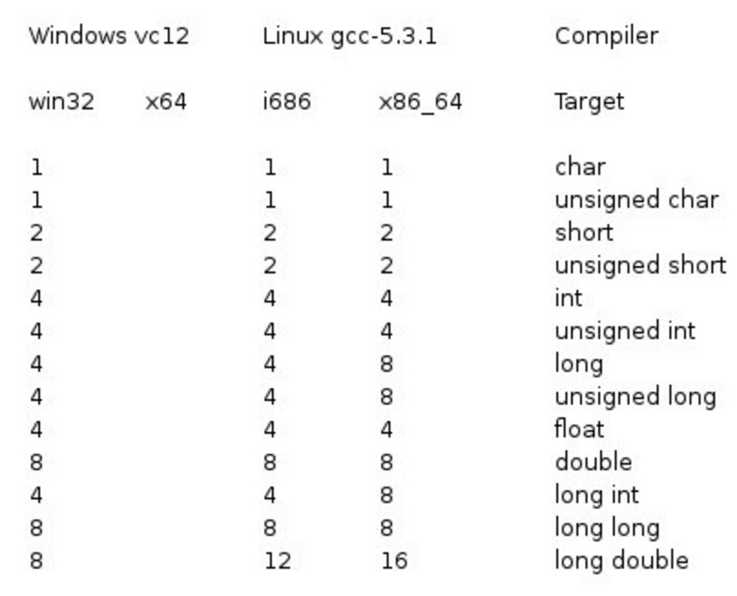

# C++ 基本语法

C++ 程序可以定义为对象的集合，这些对象通过调用彼此的方法进行交互。

* 类：描述对象行为、状态的模板
* 对象：类的实例，具有状态和行为
* 方法：一个方法描述类的一种行为，一个类可以有多种方法。在方法中可以写入逻辑、操作数据等某个动作。
* 即时变量：每个对象都有其独特的即时变量。对象的状态由这些即时变量的值来创建。


## 1 Hello World

```cpp
#include <iostream>
using namespace std;

int main() {
    cout << "Hello World!\n";
    return 0;
}
```

编译 & 执行：

```bash
g++ 001_helloworld.cpp -o 001_helloworld.o
./001_helloworld.o

# Hello World!
```


## 2 基本语法

### 2.1 分号 & 语句块

在 C++ 中，分号是语句结束符。也就是说，每个语句必须以分号结束。它表明一个逻辑实体的结束。

语句块是一组使用大括号括起来的按逻辑连接的语句。

C++ 不以行末作为结束符的标识，因此，可以在一行上放置多个语句。

```cpp
// 分号结束的语句
x = y;
y = y+1;

// 语句块
{
   cout << "Hello World";
   return 0;
}

// 一行多个语句
x = y; y = y+1;
```


### 2.2 C++ 标识符

C++ 标识符是用来标识变量、函数、类、模块，或任何其他用户自定义项目的名称。

一个标识符以字母 A-Z 或 a-z 或下划线 _ 开始，后跟零个或多个字母、下划线和数字（0-9）。且 C++ 的标识符区分大小写。

C++11 之后，支持 unicode 标识符，因此标识符里面可以使用汉字了。


### 2.3 C++ 关键字

关键字，即保留字，保留字不能作为标识符名称。

|asm|auto|bool|break|case|
|---|---|---|---|---|
|catch|char|class|const|const_cast|
|continue|default|delete|do|double|
|dynamic_cast|else|enum|explicit|export|
|extern|false|float|for|friend|
|goto|if|inline|int|long|
|mutable|namespace|new|operator|private|
|protected|public|register|reinterpret_cast|return|
|short|signed|sizeof|static|static_cast|
|struct|switch|template|this|throw|
|true|try|typedef|typeid|typename|
|union|unsigned|using|virtual|void|
|volatile|wchar_t|while|


### 2.4 三字符组

三字符组就是**用于表示另一个字符的三个字符序列**，又称为三字符序列。三字符序列总是以两个问号开头。

三字符序列不太常见，但 C++ 标准允许把某些字符指定为三字符序列。之所以有这个模式因为以前这些字符键盘上没有，这是必不可少的一种方法。

三字符序列可以出现在任何地方，包括**字符串**、**字符序列**、**注释**和**预处理指令**。

最常用的三字符序列：

|三字符组|替换字符|
|---|---|
|??=|#|
|??/|\|
|??'|^|
|??(|[|
|??)|]|
|??!|l|
|??<|{|
|??>|}|
|??-|~|


如果希望在源程序中有两个连续的问号，且不希望被预处理器替换，这种情况出现在字符常量、字符串字面值或者是程序注释中，可选办法是用字符串的自动连接：`"...?""?..."`或者转义序列：`"...?\?..."`。

在较新的 g++ 里面，编译器默认不再自动替换三字符组。如果需要使用三字符组替换（如为了兼容古老的软件代码），需要设置编译器命令行选项 `-trigraphs`。如果没有这个编译选项，编译器会给出警告，并且会按照原样输出。

例如：

```cpp
#include <iostream>
using namespace std;

int main() {
    cout << "??=\nHello World!\n??< ??>";
    return 0;
}
```

g++14 使用编译命令:`g++ 002_test_trigraphs.cpp -o 002_test_trigraphs.o`

会出现 warning

```bash
002_test_trigraphs.cpp:5:14: warning: trigraph ??= ignored, use -trigraphs to enable [-Wtrigraphs]
    5 |     cout << "??=\nHello World!\n??< ??>";
      |
002_test_trigraphs.cpp:5:33: warning: trigraph ??< ignored, use -trigraphs to enable [-Wtrigraphs]
002_test_trigraphs.cpp:5:37: warning: trigraph ??> ignored, use -trigraphs to enable [-Wtrigraphs]
```

执行的时候会按照原样输出：

```bash
??=
Hello World!
??< ??>
```


g++14 使用编译命令:`g++ 002_test_trigraphs.cpp -o 002_test_trigraphs.o -trigraphs`，不会出现 warning，并且执行输出符合预期：

```bash
#
Hello World!
{ }
```


### 2.5 关于空格的说明

只包含空格的行，被称为空白行，可能带有注释，C++ 编译器会完全忽略它。

在 C++ 中，空格用于描述空白符、制表符、换行符和注释。空格分隔语句的各个部分，让编译器能识别语句中的某个元素（比如 int）在哪里结束，下一个元素在哪里开始。


### 2.6 注释

程序的注释是解释性语句，可以在 C++ 代码中包含注释，这将提高源代码的可读性。

C++ 支持单行注释和多行注释。注释中的所有字符会被 C++ 编译器忽略。

* 单行注释：以 `//` 开始，直到行末为止。
```cpp
int a; // 注释
```

* 多行注释：

```bash
int a;
/*
注释
注释
*/
int b;
```


### 2.7 数据类型

存储各种数据类型（比如字符型、宽字符型、整型、浮点型、双浮点型、布尔型等）的信息，操作系统会根据变量的数据类型，来分配内存和决定在保留内存中存储什么。


#### 2.7.1 基本的内置类型

* 七种基本的 C++ 数据类型：

|类型|关键字|
|---|---|
|布尔型|bool|
|字符型|char|
|整型|int|
|单精度浮点型|float|
|双精度浮点型|double|
|无类型|void|
|宽字符型|wchar_t|

`wchar_t`是这样来的：

```cpp
typedef int wchar_t;
```

`wchar_t`实际上的空间是和 `int` 一样。

例如：

```cpp
#include <iostream>

int  main() {
    wchar_t ch = 'a';
    std::cout << "ch: " << ch << std::endl;
    std::cout << "sizeof(ch): " << sizeof(ch) << std::endl;
    std::cout << "sizeof(int): " << sizeof(int) << std::endl;
    std::cout << "sizeof(long long int): " << sizeof(long long int) << std::endl;
    std::cout << "sizeof(long int): " << sizeof(long int) << std::endl;
    std::cout << "sizeof(short int): " << sizeof(short int) << std::endl;
    return 0;
}
```

输出如下：

```bash
ch: 97
sizeof(ch): 4
sizeof(int): 4
sizeof(long long int): 8
sizeof(long int): 8
sizeof(short int): 2
```


* 一些基本类型可以使用一个或多个类型修饰符进行修饰：

|修饰符|描述|示例|
|---|---|---|
|signed|表示有符号类型（默认）|`signed int x = -10;`|
|unsigned|表示无符号类型|`unsigned int y = 10;`|
|short|表示短整型|`short int z = 100;`|
|long|表示长整型|`long int a = 100000;`|
|const|表示常量，值不可修改|`const int b = 5;`|
|volatile|表示变量可能被意外修改，禁止编译器优化|`volatile int c = 10;`|
|mutable|表示类成员可以在 const 对象中修改|`mutable int counter;`|


* 各种变量类型在内存中存储值时需要占用的内存，以及该类型的变量所能存储的最大值和最小值：

*不同系统会有所差异，一字节为 8 位。*
*默认情况下，int、short、long都是带符号的，即 signed。*
*long int 8 个字节，int 都是 4 个字节。*
*哦豁，和之前学的时候不一样了。记忆中 int 和 long int 是一样的，64 位系统中都是 4 字节，long long int 是 8 字节；从上面的实验看，现在 long int 和 long long int 是一样的了。*

|数据类型|描述|大小（字节）|取值范围|
|---|---|---|---|
|bool|布尔类型，表示真或假|1|true 或 false|
|char|字符类型，通常用于存储 ASCII 字符|1|-128 到 127 或 0 到 255|
|signed char|有符号字符类型|1|-128 到 127|
|unsigned char|无符号字符类型|1|0 到 255|
|wchar_t|宽字符类型，用于存储 Unicode 字符|2 或 4|取决于平台|
|char16_t|16 位 Unicode 字符类型（C++11 引入）|2|0 到 65,535|
|char32_t|32 位 Unicode 字符类型（C++11 引入）|4|0 到 4,294,967,295|
|short|短整型|2|-32,768 到 32,767|
|unsigned short|无符号短整型|2|0 到 65,535|
|int|整型|4|-2,147,483,648 到 2,147,483,647|
|unsigned int|无符号整型|4|0 到 4,294,967,295|
|long|长整型|4 或 8|取决于平台|
|unsigned long|无符号长整型|4 或 8|取决于平台|
|long long|长长整型（C++11 引入）|8|-9,223,372,036,854,775,808 到 9,223,372,036,854,775,807|
|unsigned long long|无符号长长整型（C++11 引入）|8|0 到 18,446,744,073,709,551,615|
|float|单精度浮点数|4|约 ±3.4e±38（6-7 位有效数字）|
|double|双精度浮点数|8|约 ±1.7e±308（15 位有效数字）|
|long double|扩展精度浮点数|8、12 或 16|取决于平台|


* C++11 新增类型

|数据类型|描述|示例|
|---|---|---|
|auto|自动类型推断|`auto x = 10;`|
|decltype|获取表达式的类型|`decltype(x) y = 10;`|
|nullptr|空指针常量|`int* ptr = nullptr;`|
|std::initializer_list|初始化列表类型|`std::initializer_list<int> list = {1, 2, 3};`|
|std::tuple|元组类型，可以存储多个不同类型的值|`std::tuple<int, float, char> t(1, 2.0, 'a');`|

*各种类型的存储大小与系统位数有关，但目前通用的以64位系统为主。变量的大小会根据编译器和所使用的电脑而有所不同。*

* 32位系统与64位系统的存储大小的差别（windows 相同）：



环境信息：

```bash
OS: Ubuntu 22.04.5 LTS x86_64
Host: X299X AORUS MASTER -CF
Kernel: 5.15.0-141-generic
CPU: Intel i9-10940X (28) @ 4.600GHz
```

在当前的环境下的各种类型的大小：

```bash
type:           ************size**************
bool:           所占字节数：1   最大值：1               最小值：0
char:           所占字节数：1   最大值          最小值：▒
signed char:    所占字节数：1   最大值          最小值：▒
unsigned char:  所占字节数：1   最大值：▒               最小值：
wchar_t:        所占字节数：4   最大值：2147483647              最小值：-2147483648
short:          所占字节数：2   最大值：32767           最小值：-32768
int:            所占字节数：4   最大值：2147483647      最小值：-2147483648
unsigned:       所占字节数：4   最大值：4294967295      最小值：0
long:           所占字节数：8   最大值：9223372036854775807     最小值：-9223372036854775808
unsigned long:  所占字节数：8   最大值：18446744073709551615    最小值：0
double:         所占字节数：8   最大值：1.79769e+308    最小值：2.22507e-308
long double:    所占字节数：16  最大值：1.18973e+4932   最小值：3.3621e-4932
float:          所占字节数：4   最大值：3.40282e+38     最小值：1.17549e-38
size_t:         所占字节数：8   最大值：18446744073709551615    最小值：0
string:         所占字节数：32
```


#### 2.7.2 派生数据类型

|数据类型|描述|示例|
|---|---|---|
|数组|相同类型元素的集合|int arr[5] = {1, 2, 3, 4, 5};|
|指针|存储变量内存地址的类型|int* ptr = &x;|
|引用|变量的别名|int& ref = x;|
|函数|函数类型，表示函数的签名|int func(int a, float b);|
|结构体 struct|用户定义的数据类型，可以包含多个不同类型的成员|struct Point {int x; int y;};|
|类 class|用户定义的数据类型，支持封装、继承和多态|class MyClass {...};|
|联合体union|多个成员共享同一块内存|union Data {int i; float f;};|
|枚举 enum|用户定义的整数常量集合|enum Color {READ, GREEN, BLUE};|


#### 2.7.3 类型别名

|别名|描述|示例|
|---|---|---|
|typedef|为现有类型定义别名|typedef int MyInt;|
|using|为现有类型定义别名（C++11 引入）|using MyInt = int;|


#### 2.7.4 标准库类型

|数据类型|描述|示例|
|---|---|---|
|std::string|字符串类型|std::string s = "Hello";|
|std::vector|动态数字|std::vector<int> v = {1, 2, 3};|
|std::array|固定大小数组（C++11 引入）|std::array<int, 3> a = {1, 2, 3};|
|std::pair|存储两个值的容器|std::pair<int, float> p(1, 2.0);|
|std::map|键值对容器|std::map<int, std::string> m;|
|std::set|唯一值集合|std::set<int> s = {1, 2, 3;}|


#### 2.7.5 typedef 声明

可以使用 typedef 为一个已有的类型取一个新的名字：

```cpp
typedef type newname; 

typedef int feet;
// 声明一个变量
feet distance;
```

#### 2.7.6 枚举类型

枚举类型(enumeration)是C++中的一种派生数据类型，它是由用户定义的若干枚举常量的集合。

如果一个变量只有几种可能的值，可以定义为枚举(enumeration)类型。所谓"枚举"是指将变量的值一一列举出来，变量的值只能在列举出来的值的范围内。

```cpp
enum 枚举名{
    标识符[=整型常数],
    标识符[=整型常数],
...
    标识符[=整型常数]
} 枚举变量;
```

如果枚举没有初始化, 即省掉 **=整型常数** 时, 则从第一个标识符开始。

定义了一个颜色枚举，变量 c 的类型为 color。最后，c 被赋值为 "blue"：

```cpp
enum color {red, green, bloe} c;
c = blue;
```

默认情况下，第一个名称的值为 0，第二个名称的值为 1，第三个名称的值为 2，以此类推。

也可以给名称赋予一个特殊的值，只需要添加一个初始值即可。

```cpp
enum color {red, green = 5, bloe} c;
```

green 的值为 5，blue 的值为 6，因为默认情况下，每个名称都会比它前面一个名称大 1，但 red 的值依然为 0。


#### 2.7.7 类型转换

类型转换是将一个数据类型的值转换为另一种数据类型的值。

C++ 中有四种类型转换：静态转换、动态转换、常量转换和重新解释转换。


* 静态转换（Static Cast）

静态转换是**将一种数据类型的值强制转换为另一种数据类型的值**。

静态转换**通常用于比较类型相似的对象之间的转换**，例如将 int 类型转换为 float 类型。

静态转换不进行任何运行时类型检查，因此可能会导致运行时错误。

```cpp
int i = 0;
float f = static_cast<float>(i); // int --> float
```


* 动态转换（Dynamic Cast）

动态转换（dynamic_cast）是 C++ 中用于**在继承层次结构中进行向下转换（downcasting）的一种机制**。

动态转换**通常用于将一个基类指针或引用转换为派生类指针或引用**。

动态转换在运行时进行类型检查。如果转换失败，**对于指针类型会返回 `nullptr`，对于引用类型则会抛出 `std::bad_cast` 异常**。

```cpp
dynamic_cast<目标类型>(表达式)

// 目标类型：必须是指针或引用类型。
// 表达式：需要转换的基类指针或引用。
```

例如：

```cpp
#include <iostream>

class Base {
    public:
        virtual ~Base() = default;
};

class Derived: public Base {
    public:
        void show() {
            std::cout << "Derived class method" << std::endl;
        }
};

int main() {
    Base* ptr_base = new Derived;
    Derived derived_obj;
    Base& ref_base = derived_obj;

    Derived* ptr_derived = dynamic_cast<Derived*>(ptr_base);    // Base* --> Derived*
    if (ptr_derived) {
        ptr_derived -> show();
    } else {
        std::cout << "Dynamic cast failed" << std::endl;
    }

    try {
        Derived& ref_derived = dynamic_cast<Derived&>(ref_base);    // Base& --> Derived&
        ref_derived.show();
    } catch (const std::bad_cast& e) {
        std::cout << "Dynamic cast failed: " << e.what() << std::endl;
    }

    delete ptr_base;
    return 0;
}
```

运行后输出：

```bash
Derived class method
Derived class method
```


dynamic_cast 性能开销较大，且要求基类必须有虚函数。


* 常量转换（Const Cast）

常量转换**用于将 const 类型的对象转换为非 const 类型的对象**。

常量转换**只能用于转换掉 const 属性，不能改变对象的类型**。

```cpp
const int i = 10;
int& r = const_cast<int&>(i);   // const int --> int
```


* 重新解释转换（Reinterpret Cast）

重新解释转换**将一个数据类型的值重新解释为另一个数据类型的值，通常用于在不同的数据类型之间进行转换**。

重新解释转换**不进行任何类型检查**，因此可能会导致未定义的行为。

```cpp
int i = 10;
float f = reinterpret_cast<float&>(i);  // 将int类型转换为float类型，把 int 型的内存按照 float 的方式来读取
```


例如：

```cpp
#include <iostream>

int main() {
    int a = 10;
    float b = static_cast<float>(a);
    float c = reinterpret_cast<float&>(a);
    std::cout << "a: " << a << std::endl;
    std::cout << "static_cast<float>(a): " << b << std::endl;
    std::cout << "reinterpret_cast<float&>(a): " << c << std::endl;
    return 0;
}
```


输出如下：

```bash
a: 10
static_cast<float>(a): 10
reinterpret_cast<float&>(a): 1.4013e-44
```

