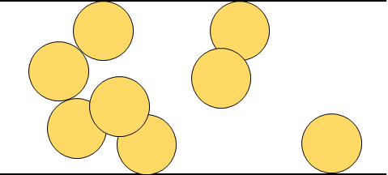

## 并查集

并查集支持两种草操作：

* 合并，把两个不相交的集合合并为一个集合
* 查询，查询两个元素是否在同一个集合中


* 初始化，

一开始，将各个元素的父节点设为自己，使用数组 fa[] 来存储每个元素的父节点，那么：

```cpp
int fa[MAXN];
inline void init(int n) {
    for (int i = 1; i <= n; i++) {
        fa[i] = i;
    }
}
```


* 查询，

利用递归的写法来实现对代表元素的查询，一层一层访问父节点，直至根节点（根节点的标志是父节点是本身）。要判断两个元素是否在同一个集合中，只需要看他们的根节点是否相同即可。

```cpp
int find(int x) {
    if (fa[x] == x) return x;
    else return find(fa[x]);
}
```


* 合并，

合并操作先找到两个集合的代表元素，然后将前者的父节点设置为后者即可，也可以把后者的父节点设置成前者，这个暂时不重要。

```cpp
inline void merge(int i, int j) {
    fa[find[i]] = find(j);
}
```


* 路径压缩，

最简单的并查集效率比较低，例如在节点形成一个长链的时候，想要从底部找到根节点，会耗时比较久。对于这种情况，可以使用路径压缩的方法。

由于只关心元素对应的根节点，希望元素到根节点的路径尽可能短，那么可以将这样的元素直接连接到根节点上。在查询过程中，把沿途的每个节点的父节点都设为根节点即可，那么在下一次的查询时，就可以很省事了。

```cpp
int find(int x) {
    if (x = fa[x]) return x;
    else {
        fa[x] = find(fa[x]); //父节点设为根节点
        return fa[x];
    }
}


// return x == fa[x] ? x : (fa[x] = find(fa[x]));
```


* 按秩合并，

在合并的时候，优先考虑将简单的树往复杂的树上合并，这样在合并后，可以尽可能少的影响其他节点的树深度。

使用一个数组 rank[] 记录每个根节点对应的树的深度，如果不是根节点，其 rank 相当于以它为根节点的子树的深度。开始，将所有子树的 rank 设为 1，合并时比较两个根节点，把 rank 较小者往较大者上合并。

路径压缩和按秩合并一起使用，时间复杂度接近 O(n)，但是可能破坏秩的准确性。

```cpp
// init
iniline void init(int n) {
    for (int i = 1; i <= n; i++) {
        fa[i] = i;
        rank[i] = 1;
    }
}

// merge with rank
inliner void merge(int i, int j) {
    int x = find(i), y = find(j);
    if (rank[x] <= rank[y]) fa[x] = y;
    else fa[y] = x;

    if (rank[x] == rank[y] &Y& x != y) rank[y]++;   //如果深度相同且根节点不同，则新的根节点的深度+1
}
```


一个应用，

现有一块大奶酪，它的高度为 h ，它的长度和宽度我们可以认为是无限大的，奶酪中间有许多半径相同的球形空洞。我们可以在这块奶酪中建立空间坐标系，在坐标系中， 奶酪的下表面为 z=0，奶酪的上表面为 z=h 。

现在，奶酪的下表面有一只小老鼠 Jerry，它知道奶酪中所有空洞的球心所在的坐标。如果两个空洞相切或是相交，则 Jerry 可以从其中一个空洞跑到另一个空洞，特别地，如果一个空洞与下表面相切或是相交，Jerry 则可以从奶酪下表面跑进空洞；如果一个空洞与上表面相切或是相交，Jerry 则可以从空洞跑到奶酪上表面。
位于奶酪下表面的 Jerry 想知道，在 不破坏奶酪 的情况下，能否利用已有的空洞跑到奶酪的上表面去?



思路，将空洞划分为若干个集合，一旦两个空洞相交或者相切，就把他们放到同一个集合中。找出两个特殊元素，分别表示底部和顶部，如果一个空洞与底部接触，则把他与表示底部的元素放在同一个集合，顶部同理。最后只需要看顶部和底部是不是在同一个集合中即可。

```cpp
#include <iostream>
#include <vector>

#define MAXN 1005
int fa[MAXN], rank[MAXN];

inline void init(int n) {
    for (int i = 1; i <= n; i++) {
        fa[i] = i;
        rank[i] = 1;
    }
}

inline int find(int x) {
    return fa[x] == x ? x : (fa[x] = find(fa[x]));
}

inline void merge(int i, int j) {
    int x = find(i), y = find(j);
    if (rank[x] <= rank[y]) fa[x] = y;
    else fa[y] = x;
    if (rank[x] == rank[y] && x != y) rank[y] += 1;
}

bool next_to(int x1, int y1, int z1, int x2, int y2, int z2, int r) {
    return (x1-x2)*(x1-x2) + (y1-y2)*(y1-y2) + (z1-z2)*(z1-z2) <= 4 * r * r;
}


int main() {
    int r = 6;
    int h = 10;
    std::vector<int> x = {1, 2, 3, 4, 5, 6, 7, 8, 9, 10};
    std::vector<int> y = {2, 3, 4, 5, 6, 7, 8, 9, 10, 11};
    std::vector<int> z = {3, 4, 5, 6, 7, 8, 9, 10, 11, 12};
    init(x.size());
    fa[1001] = 1001; // 用1001代表底部
    fa[1002] = 1002; // 用1002代表顶部
    for (int i = 1; i < x.size() - 1; i++) {
        if (z[i] <= r) merge(i, 1001);
        if (z[i] + r >= h) merge(i, 1002);
    }
    for (int i = 1; i < x.size() - 1; i++) {
        for (int j = i + 1; j < x.size(); j++) {
            if (next_to(x[i], y[i], z[i],  x[j], y[j], z[j], r)) {
                merge(i, j);
            }
        }
    }
    std::cout << (find(1001) == find(1002) ? "Yes" : "No") << std::endl;
    return 0;
}
```
