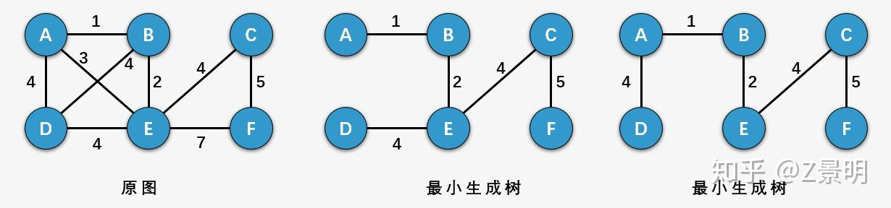

## 最小生成树


### 1 生成树

一个连通图的生成树是一个极小的联通子图，包含图中全部的 n 个顶点，单只有构成一棵树的 n-1 条边。

例如，一个包含三个顶点的完全图可以产生三棵树，即在三个顶点的完全图的基础上，缺一条边就是生成树了。

**对于包含 n 个顶点的无向完全图最多包含 $n^{n-2}$ 棵生成树**。


生成树的属性：

* 一个连通图可以有多个生成树
* 一个连通图的所有生成树都包含相同的顶点数和边数、
* 生成树中不包含环
* 移除生成树中的任意一条边都会导致图的不连通，生成树的边最少特性
* 在生成树中添加一条边会构成环
* 对于包含 n 个顶点的连通图，生成树包含 n 个顶点和 n-1 条边
* 对于包含 n 个顶点的无向图，最多包含 $n^{n-2}$ 棵生成树

一个连通图的生成树是一个极小连通子图，他含有图中的所有顶点，但只有足以构成树的 n-1 条边，且生成树不唯一。


### 2 最小生成树

一个带权图的最小生成树，就是原图中边的权值最小的生成树，所谓的最小指的是边的权值之和小于等于其他生成树的边的权值之和。

最小生成树是和带权图联系在一起的，如果仅仅是非带权的图，只存在生成树。



最小生成树实际上是最小代价生成树，即所生成树的极小子树各边的权值之和最小。产生最小生成树的方法有两种，prime 算法和 kruskal 算法。kruskal 算法时间复杂度更小，是 O(nlogn)。

最小生成树的解法一般分为三步：

* 使用结构体把每条边的短点和权值记录下来，然后对每条边按照权值进行排序。
* n 个节点的连通图至少有 n-1 条边，从小到大遍历所有的边，如果该边的端点不在当前的连通分支中，则将其加入其中。关于端点是否属于同一连通分支，可以使用并查集的 find 方法来追踪每一个端点，使用数组 fa 来记录其父节点
* 当遍历到最后一条边或者边数超过 n-1 时，结束遍历

并不是所有的图都是连通的，如果边的数量小于 n-1，那么就不存在最小生成树。

最小生成树的模板：

```cpp
struct edge {
    int u, v, w;
    edge(){}
    edge(int u, int v, int w): u(u), v(v), w(w){}
    friend bool operator< (edge a, edge b) {
        return a.w < b.w;
    }
} e[N*N];

int find(int x) {
    return x == fa[x] ? x : (fa[x] == find(fa[x]));
}

sort (e+1, e+k+1);

for (int i = 1; i <= k && num < n-1; i++) {
    int fu = find(e[i].u), fv = find(e[i].v);
    if (fv != fu) {
        fa[fu] = fv;
        num++;
        sum += e[i].w;
    }
}
```

用一个7位的string代表一个编号，两个编号之间的distance代表这两个编号之间不同字母的个数。一个编号只能由另一个编号“衍生”出来，代价是这两个编号之间相应的distance，现在要找出一个“衍生”方案，使得总代价最小，也就是distance之和最小。

```cpp
#include<iostream>
#include<cstdio>
#include<cstring>
#include<stack>
#include<algorithm>
using namespace std;
const int N=2e3+10;

int n,f[N],num,k,sum;
char s[N][10];

struct edge{
	int u,v,w;
	edge(){}
	edge(int u,int v,int w):u(u),v(v),w(w){}
	friend bool operator<(edge a,edge b){
		return a.w<b.w;
	}
}e[N*N];

int dis(int i, int j) {
    int num = 0;
    for (int k = 0; k < 7; k++) {
        if (s[i][k] != s[j][k]) num++;
    }
    return num;
}

int find(int x) {
    return x == fa[x] ? x : (fa[x] == find(fa[x]));
}

int main() {
    while (scans("%d", &n) && n) {
        for (int i = 1; i <= n; i++) scanf("%s", s[i]);
        for (int i = 1; i <= n; i++) f[i] = i;
        num = 0; k = 0; sum=0;
        for (int i = 0; i < n; i++) {
            for (int j =i+1; j <= n; j++) {
                e[++k] = edge(i, j, dis(i, j));
            }
        }
        sort(e+1, e+k+1);

        for (int i = 1; i <= k && num < n-1; i++) {
            int fu = find(e[i].u), fv = find(e[i].v);
            if (fv != fu) {
                fa[fu] = fv;
                num++;
                sum += e[i].w;
            }
        }
        printf("The highest possible quality is 1/%d.\n",sum);
    }
    return 0;
}
```


#### 2.1 prime 算法

Prim 算法原理，从任意顶点开始都可以，

1) 以某一个点开始，寻找当前该点可以访问到的所有的边
2) 寻找该点可以访问到的所有的边里面边的另一个端点没有访问过，并且边的权值最小的边，将这个吗，没有访问过的端点添加进集合，并且记录添加的边
3) 寻找当前的集合可以访问到的边，重复 2 的过程，直到没有新的点可以加入为止
4) 此时由所有的边构成的树就是最小生成树

```cpp
#include <climits>
#include <cstdbool>
#include <iostream>
#include <vector>
#define NUMPOINT 7

void print_MST(std::vector<std::vector<int>> graph, std::vector<int> trace) {
    std::cout << "Edge \tWeight\n";
    int total_cost = 0;
    for (int i = 1; i < NUMPOINT; i++) {
        std::cout << trace[i] << "->" << i << "\t" << graph[i][trace[i]] << std::endl;
        total_cost += graph[i][trace[i]];
    }
    std::cout << "TotalCost\t" << total_cost << std::endl;
}

void primMST(std::vector<std::vector<int>> graph) {
    std::vector<int> trace(NUMPOINT);
    std::vector<bool> visited(NUMPOINT, false);
    std::vector<int> min_edge(NUMPOINT);
    int total_cost = 0;
    trace[0] = -1;
    visited[0] = true;
    min_edge[0] = 0;

    // init min_edge with node 0
    for (int i = 1; i < NUMPOINT; i++) {
        min_edge[i] = graph[0][i];
    }

    // select min edge with current node
    for (int i = 1; i < NUMPOINT; i++) {
        int min_val = INT_MAX;
        int min_idx = -1;

        // select min edge with node0
        for (int j = 0; j < NUMPOINT; j++) {
            if (visited[j] == false && min_val > min_edge[j] && min_edge[j] != -1) {
                min_val = min_edge[j];
                min_idx = j;
            }
        }
        // add into selected  graph
        visited[min_idx] = true;
        total_cost += min_edge[min_idx];
        std::cout << min_idx << "-" << min_edge[min_idx] << std::endl;

        // update min_edge with the selected graph
        for (int j = 0; j < NUMPOINT; j++) {
            if (visited[j] == false && graph[min_idx][j] != -1 && (min_edge[j] == -1 || min_edge[j] > graph[min_idx][j])) {
                min_edge[j] = graph[min_idx][j];
                trace[j] = min_idx;
            }
        }
    }
    std::cout << "mincost: " << total_cost << std::endl;
    print_MST(graph, trace);
}

int main() {
    std::vector<std::vector<int>> graph = {
        { 0, 5, 9, -1, 15, 6, -1 },
        { 5, 0, 7, -1, -1,  -1, -1 },
        { 9, 7, 0, 8, 7,  -1, -1},
        { -1, -1, 8, 0, 5,  -1, -1 },
        { 15, -1, 7,5, 0,  8, 9 },
        { 6, -1, -1, -1, 8, 0, 11},
        { -1, -1, -1, -1, 9,11,0}
    };
    primMST(graph);
    return 0;
}
```


#### 2,2 kruskal 算法

假设一个图有 m 个节点，n 条边，

1) 首先需要将 m 个节点看作是 m 个独立的生成树，并且把 n 条边按照从小到大的权重进行排列。
2) 在 n 条边中，依次取出其中的每一条边，如果发现边的两个端点分别位于两棵树上，那么把两棵树合并为一棵树；如果边的两个端点位于同一棵树上，那么忽略这条边
3) 所有的边遍历完成之后，如果所有的生成树可以合并成一棵生成树，那么他就是我们寻找的最小生成树，否则就不存在最小生成树


相比之下，prim 以点为对象，挑选与点相连的最短边来构成最小生成树，kruskal 以边为对象，不断加入新的不构成环的最短的边来构成最小生成树。


```cpp
#include <climits>
#include <cstdbool>
#include <iostream>
#include <vector>
#include <algorithm>
#define NUMPOINT 7

std::vector<int> root(NUMPOINT);
std::vector<int> size(NUMPOINT);

template<class T>
void printVector(std::vector<T> v) {
    for (auto item: v) {
        std::cout << item << " ";
    }
    std::cout << std::endl;
}

void init(int n) {
    for (int i = 0; i < n; i++) {
        root[i] = i;
        size[i] = 1;
    }
}

int find_root(int x) {
    return x == root[x] ? x : (root[x] = find_root(root[x]));
}

bool merge(int x, int y) {
    int a = find_root(x);
    int b = find_root(y);
    if (a == b) return false;
    if (size[a] >= size[b]) {
        root[b] = a;
        size[a] += size[b];
    } else {
        root[a] = b ;
        size[b] += size[a];
    }
    return true;
}

bool comp(std::vector<int> a, std::vector<int> b) {
    return a[2] < b[2];
}

void kruskalMST(std::vector<std::vector<int>> graph) {
    init(NUMPOINT);
    sort(graph.begin(), graph.end(), comp);
    int mincost = 0;
    std::vector<std::vector<int>> trace;
    for (int i = 0; i < graph.size(); i++) {
        if (merge(graph[i][0], graph[i][1])) {
            mincost += graph[i][2];
            trace.push_back({graph[i]});
        }
    }
    for (int i = 0; i < trace.size(); i++) printVector(trace[i]);
    std::cout << "mincost: " << mincost << std::endl;
}


int main() {
    std::vector<std::vector<int>> graph = {
        {0, 1, 5},
        {0, 2, 9},
        {0, 4, 15},
        {0, 5, 6},
        {1, 0, 5},
        {1, 2, 7},
        {1, 0, 5},
        {2, 0, 9},
        {2, 1, 7},
        {2, 3, 8},
        {2, 4, 7},
        {3, 2, 8},
        {3, 4, 5},
        {4, 0, 15},
        {4, 2, 7},
        {4, 3, 5},
        {4, 5, 8},
        {4, 6, 9},
        {5, 0, 6},
        {5, 4, 8},
        {5, 6, 11},
        {6, 4, 9},
        {6, 5, 11}
    };
    kruskalMST(graph);
    return 0;
}
```
